# AWSKRUG Serverless Group

- since 2017
- [AWSKRUG Facebook Link](https://www.facebook.com/groups/awskrug/)
- [AWSKRUG Meetup Link](https://www.meetup.com/ko-KR/awskrug/)
- [AWSKRUG Web Site](http://www.awskr.org/)
- [AWSKRUG Slack Channel LInk](http://awskrug.slack.com)

# Meetups

## 2025년 Meetups

## [2월 25일 소모임](https://www.meetup.com/awskrug/events/306073210/)
- 일시: 2025년 2월 25일
- 발표자: 발표 주제
  - 이현제 (AWSKRUG 서버리스 오거나이저/크래프타)
    - WS SAM으로 안정적인 서버리스 결제 시스템 구축하기
  - 김진영 (AWSKRUG 서버리스 오거나이저/한국분양정보)
    - 서버리스를 활용해 서버 개발자 1명으로 MAU 10만 서비스 운영하기

&nbsp;&nbsp;&nbsp;&nbsp;&nbsp;&nbsp;&nbsp;&nbsp;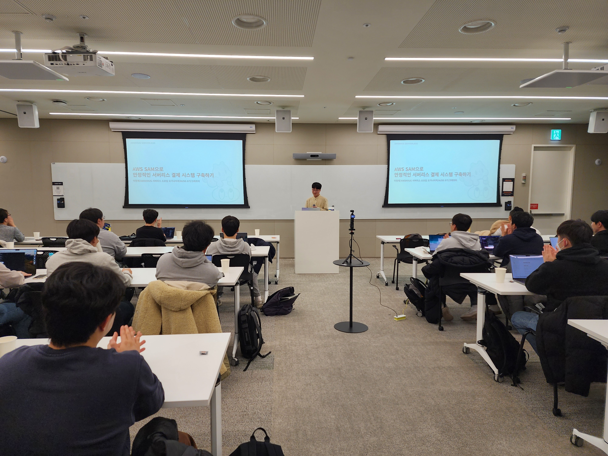

&nbsp;&nbsp;&nbsp;&nbsp;&nbsp;&nbsp;&nbsp;&nbsp;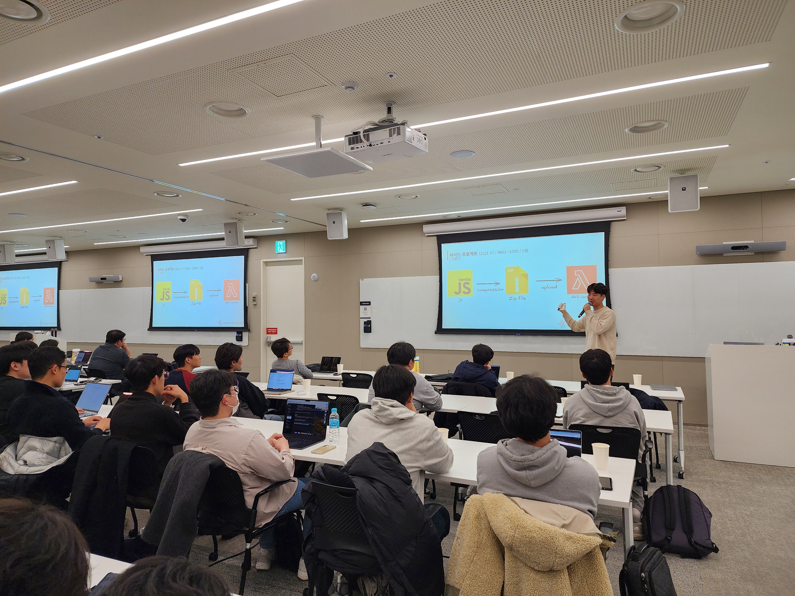

## [3월 20일 소모임](https://www.meetup.com/ko-KR/awskrug/events/306561921/)
- 일시: 2025년 3월 20일
- 발표자: 발표 주제
  - 박상운(Dev Lead, 리콘랩스)
    - 100% 서버리스로 구축하는 채팅 서버 구현 실습

## [4월 17일 소모임](https://www.meetup.com/awskrug/events/306972397/?eventOrigin=your_events)
- 일시: 2025년 4월 17일
- 발표자: 발표 주제
  - 김선우 (Serverless Operations, Inc)
    - 일본 방송국의 서버리스 기반 생성AI 업무 자동화 사례 소개

&nbsp;&nbsp;&nbsp;&nbsp;&nbsp;&nbsp;&nbsp;&nbsp;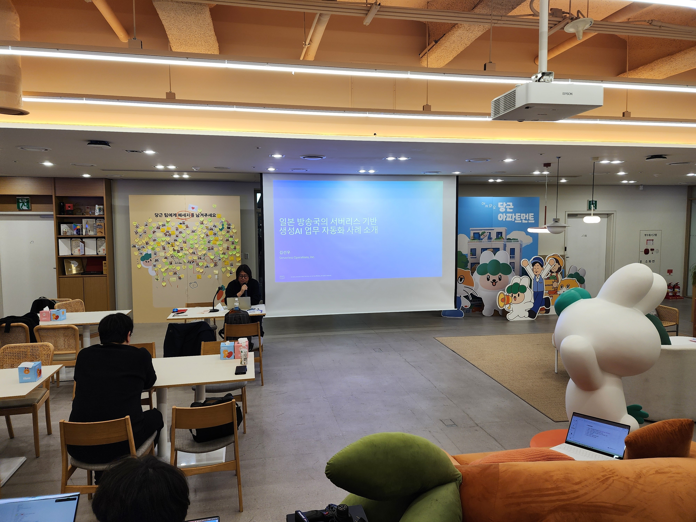

&nbsp;&nbsp;&nbsp;&nbsp;&nbsp;&nbsp;&nbsp;&nbsp;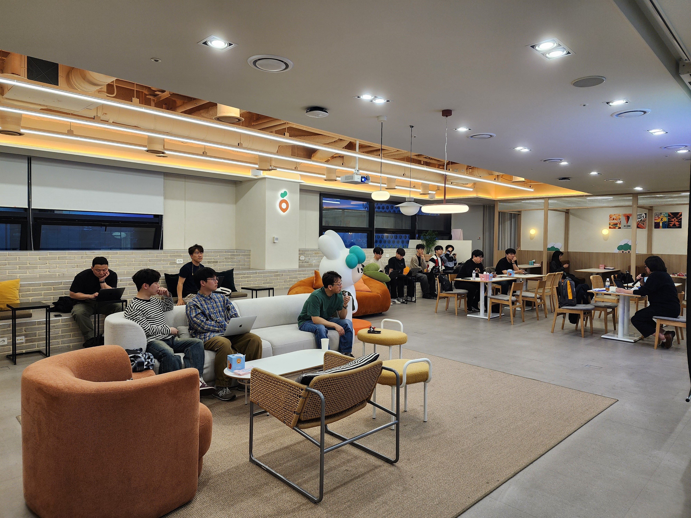

## [6월 24일 소모임](https://www.meetup.com/awskrug/events/308057565/)
- 일시: 2025년 6월 24일
- 발표자: 발표 주제
  - 구경열님 (Ktown4u DevOps)
    - 서버리스와 생성형 ai를 활용한 슬랙봇 구성 및 데모
  - 강은호님 (STAYGE Labs 데브옵스엔지니어)
    - 서버리스, 정말 관리가 필요 없을까?

&nbsp;&nbsp;&nbsp;&nbsp;&nbsp;&nbsp;&nbsp;&nbsp;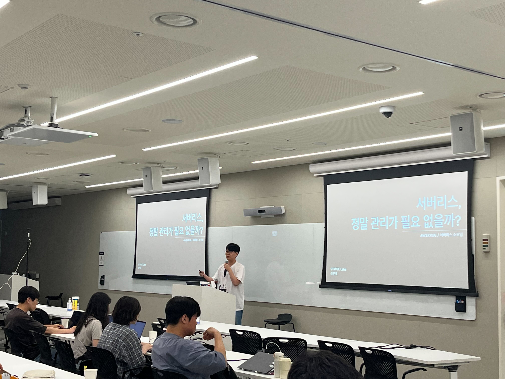

&nbsp;&nbsp;&nbsp;&nbsp;&nbsp;&nbsp;&nbsp;&nbsp;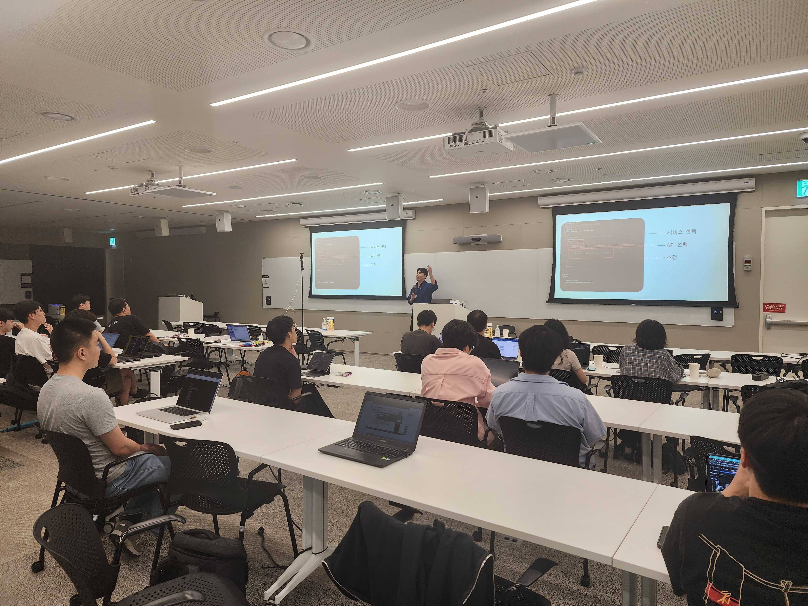

## [7월 29일 소모임](https://www.meetup.com/awskrug/events/308963371/)
- 일시: 2025년 7월 29일
- 발표자: 발표 주제
  - 박상운(Dev Lead, 리콘랩스)
    - Amazon Q를 활용한 Vibe Coding+Aurora DSQL 활용 Serverless 핸즈온: 100% Serverless 게시판 만들고 배포해보기

&nbsp;&nbsp;&nbsp;&nbsp;&nbsp;&nbsp;&nbsp;&nbsp;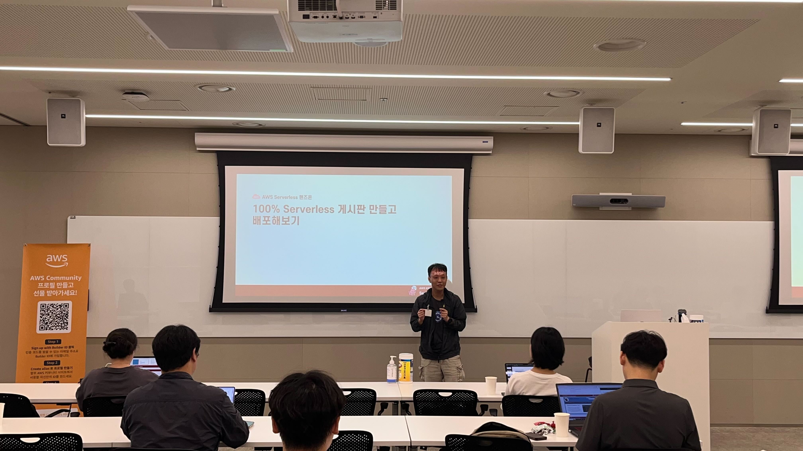

&nbsp;&nbsp;&nbsp;&nbsp;&nbsp;&nbsp;&nbsp;&nbsp;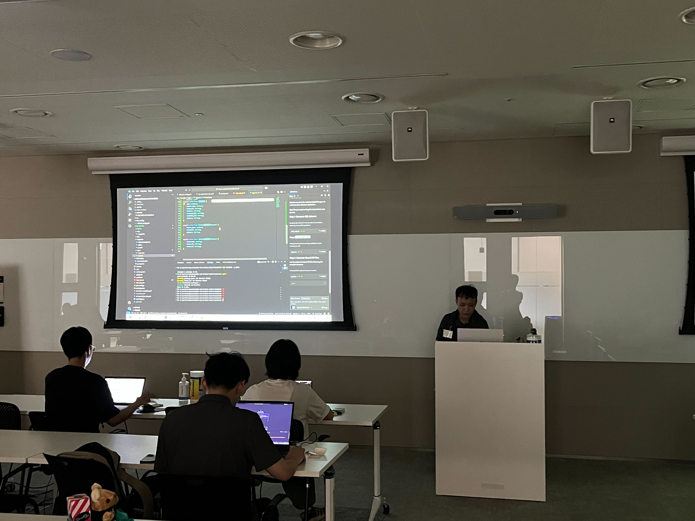

## [9월 23일 소모임](https://www.meetup.com/awskrug/events/310882066/)
- 일시: 2025년 7월 29일
- 발표자: 발표 주제
  - 박상운(Dev Lead, 리콘랩스)
    - Aurora DSQL 소개 및 활용
  - 이현제(AWSKRUG 서버리스 오거나이저/크래프타)
    - Lambda가 고정 IP를 찾아 떠난 VPC 탐험기

&nbsp;&nbsp;&nbsp;&nbsp;&nbsp;&nbsp;&nbsp;&nbsp;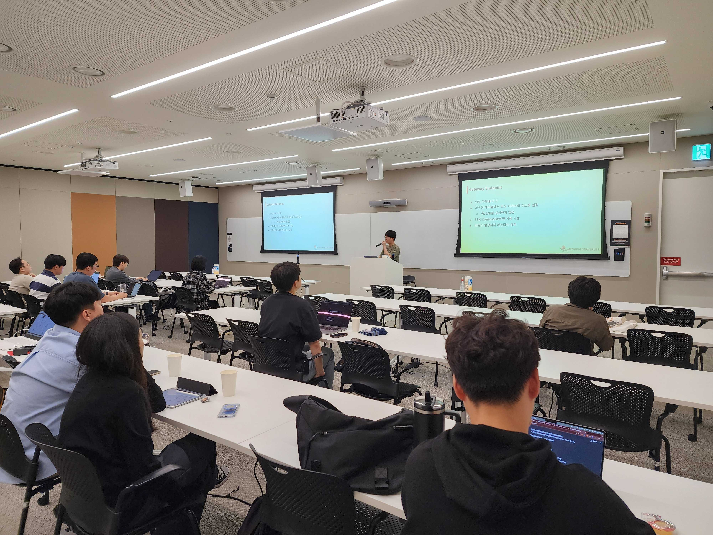

&nbsp;&nbsp;&nbsp;&nbsp;&nbsp;&nbsp;&nbsp;&nbsp;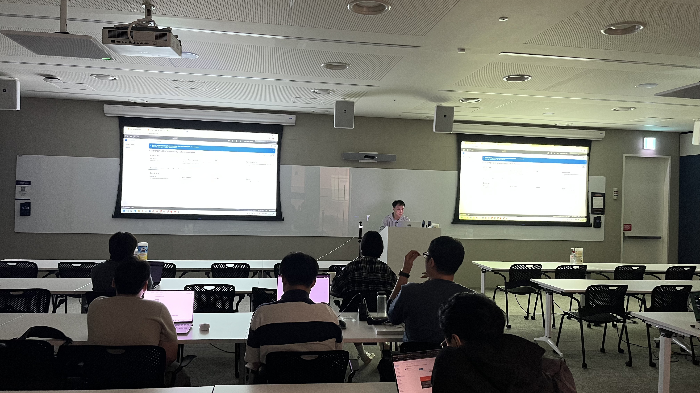

## 2023년 Meetups

  
펼쳐서 보기

## 26차 모임 : [AWS Full Serverless 기반 대기열 구현](https://www.meetup.com/ko-KR/awskrug/events/294423985/)
  - **일시** : 2023년 7월 4일
  - **발표자 : 발표주제 **
    - 박상운 (Dev Lead, 리콘랩스): [AWS Full Serverless 기반 대기열 구현](./res/20230704_AWSKRUG_Serverless_Meetup.pdf)

&nbsp;&nbsp;&nbsp;&nbsp;&nbsp;&nbsp;&nbsp;&nbsp;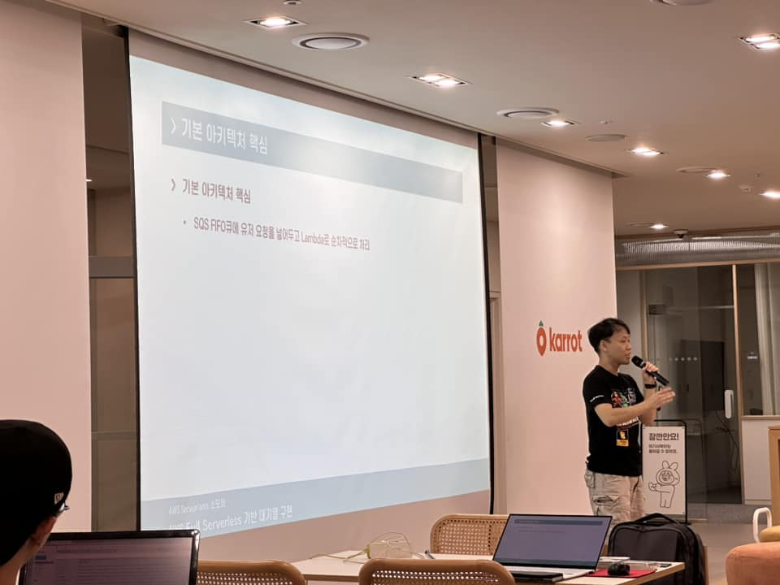

&nbsp;&nbsp;&nbsp;&nbsp;&nbsp;&nbsp;&nbsp;&nbsp;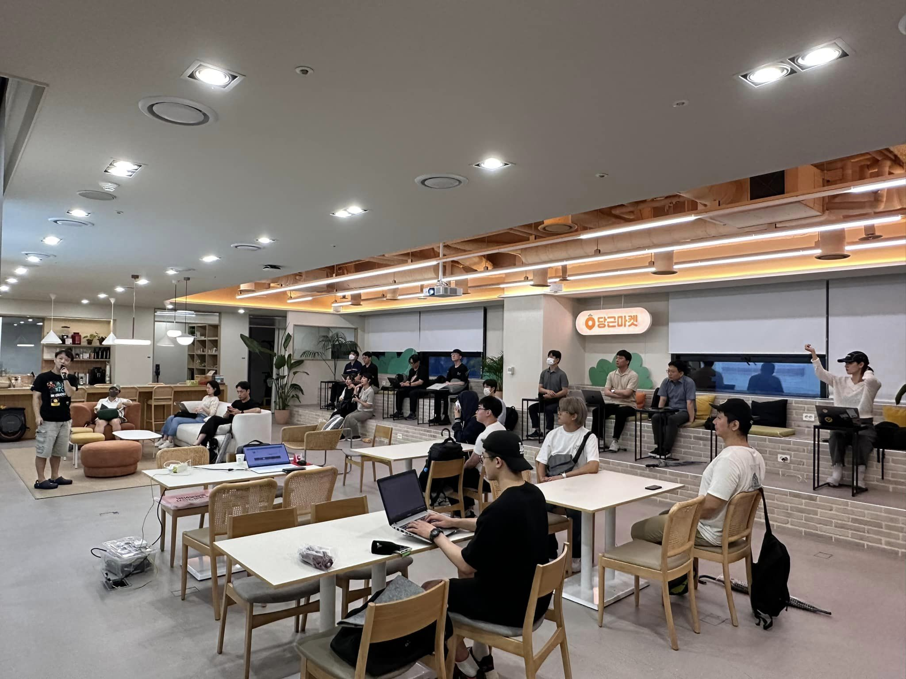

## 25차 모임 : [이벤트 기반의 응용 아키텍처 “3factor app” & Slack Bot with ChatGPT](https://www.meetup.com/ko-KR/awskrug/events/293608432/)
  - **일시** : 2023년 6월 7일
  - **발표자 : 발표주제 **
    - 김선우 (Serverless Operations, Inc): [서버리스의 장점을 극대화하는 이벤트 기반의 응용 아키텍쳐 "3factor app"의 소개 및 AWS 서버리스로 구현해보기](./res/20230607_AWSKRUG_Serverless_Meetup.pdf)
    - 유정열 (AWS ML Hero / SRE, 당근마켓): [ChatGPT 가 알려주는대로 만드는 Slack Bot](./res/20230607_SlackBot_With_ChatGPT.pdf)

&nbsp;&nbsp;&nbsp;&nbsp;&nbsp;&nbsp;&nbsp;&nbsp;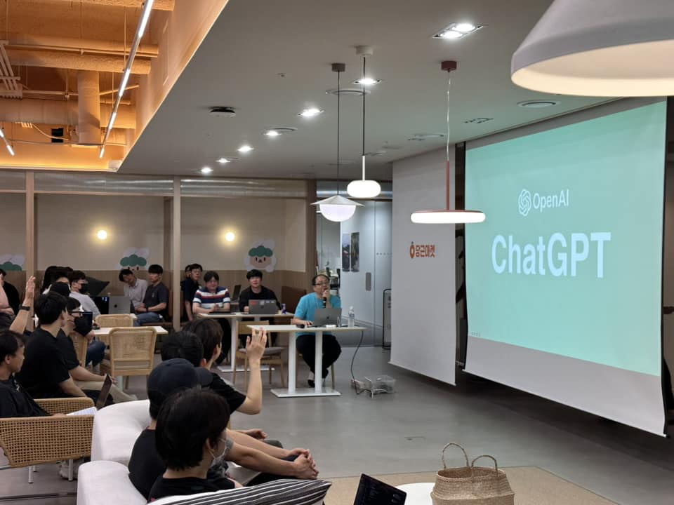

&nbsp;&nbsp;&nbsp;&nbsp;&nbsp;&nbsp;&nbsp;&nbsp;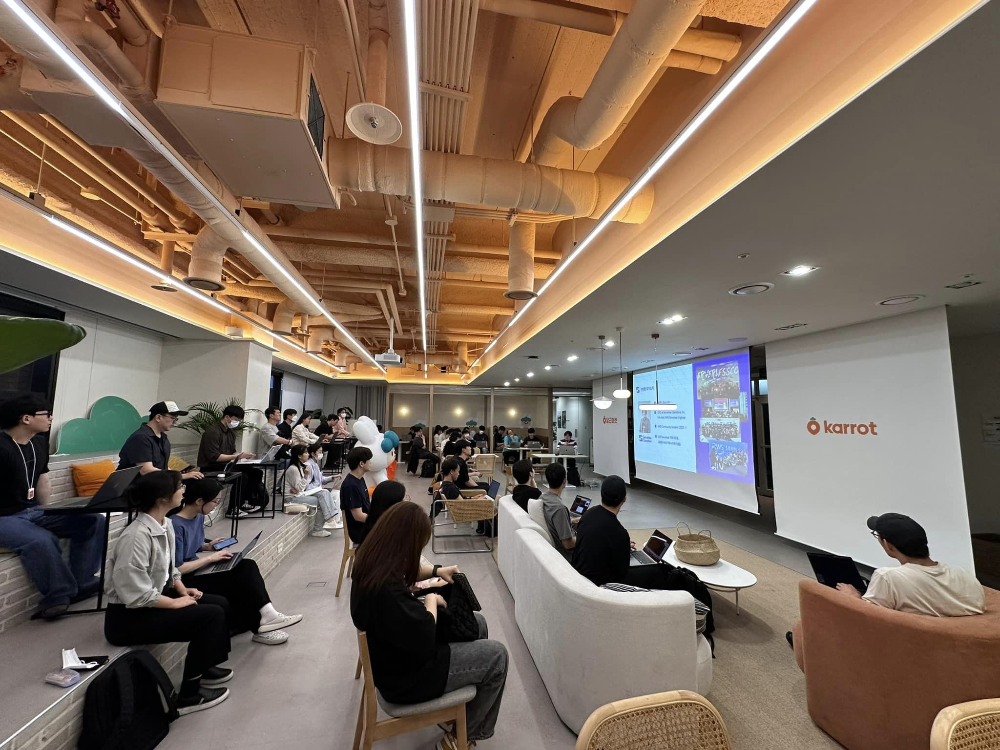

## 24차 모임 : [Serverless 를 이용한 Multi-tenancy 서비스 만들기 & Going Fully Serverless In Real World](https://www.meetup.com/awskrug/events/290550111/)
  - **일시** : 2023년 1월 10일
  - **발표자 : 발표주제 **
    - 이상희 (AWS Solution Architect): [Serverless 를 이용한 Multi-tenancy 서비스 만들기](./res/2023-01-13_serverless_multi_tenancy.pdf)
    - 이상현 (AWS Serverless Hero / Mirror CEO): [Going Fully Serverless In Real World](./res/2023-01-11_going_fully_serverless_in_real_world.pdf)

&nbsp;&nbsp;&nbsp;&nbsp;&nbsp;&nbsp;&nbsp;&nbsp;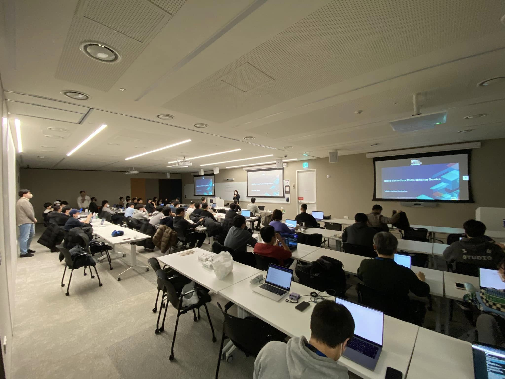

&nbsp;&nbsp;&nbsp;&nbsp;&nbsp;&nbsp;&nbsp;&nbsp;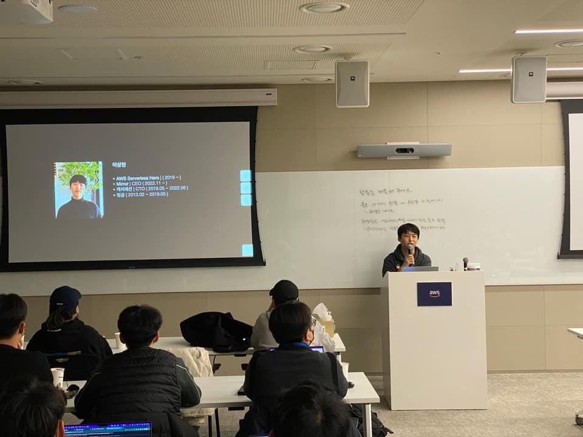

## 2020~2022년 Meetups

  
펼쳐서 보기

## 23차 모임 : [AWS Lambda 를 활용한 웹기반 Serverless 개발환경 구축 사례](https://www.meetup.com/ko-KR/awskrug/events/289305052/)
  - **일시** : 2022년 11월 8일
  - **발표자 : 발표주제 **
    - 이종훈 (CEO, 클라우드퀘스트)
      - [AWS Lambda 를 활용한 웹기반 Serverless 개발환경 구축 사례](./res/20221108.pdf)

&nbsp;&nbsp;&nbsp;&nbsp;&nbsp;&nbsp;&nbsp;&nbsp;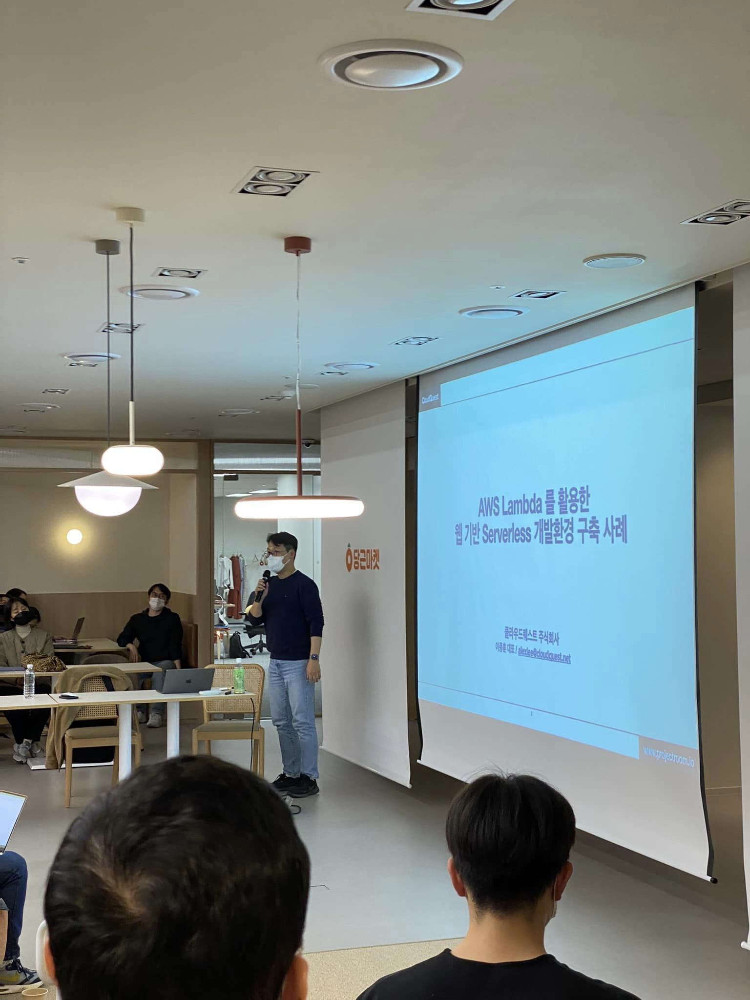

&nbsp;&nbsp;&nbsp;&nbsp;&nbsp;&nbsp;&nbsp;&nbsp;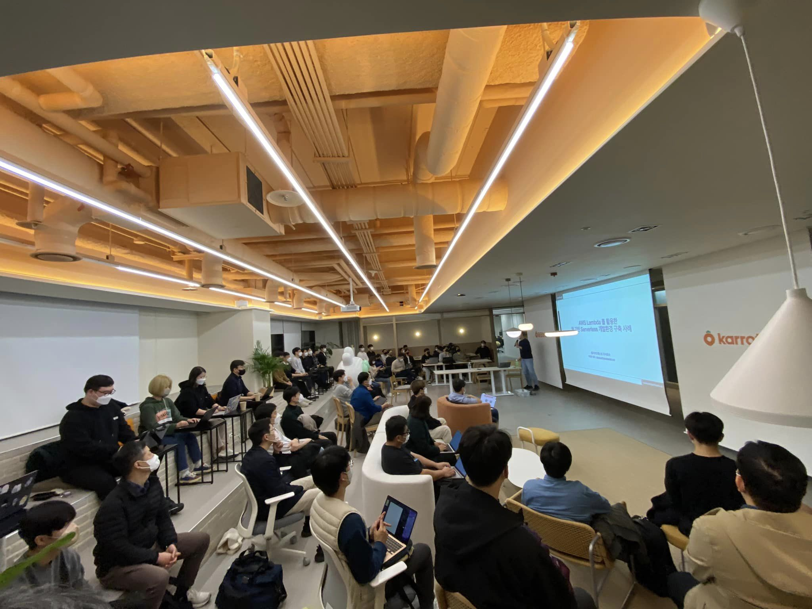

## 22차 모임 : [Back to the basic: 람다를 잘 쓰기 위한 방법!](https://www.meetup.com/ko-KR/awskrug/events/288666270/)
  - **일시** : 2022년 10월 4일
  - **발표자 : 발표주제 **
    - 신재현 (SRE Engineer, 무신사)
      - [Back to the basic: 람다를 잘 쓰기 위한 방법!](https://mysetting.io/slides/back-to-the-basic-lambda)

&nbsp;&nbsp;&nbsp;&nbsp;&nbsp;&nbsp;&nbsp;&nbsp;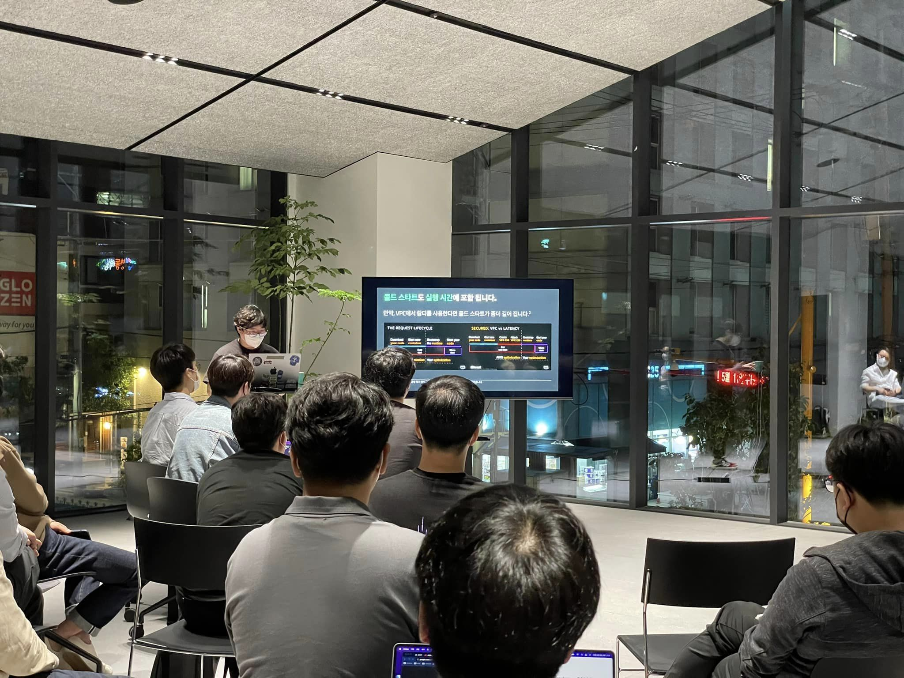

&nbsp;&nbsp;&nbsp;&nbsp;&nbsp;&nbsp;&nbsp;&nbsp;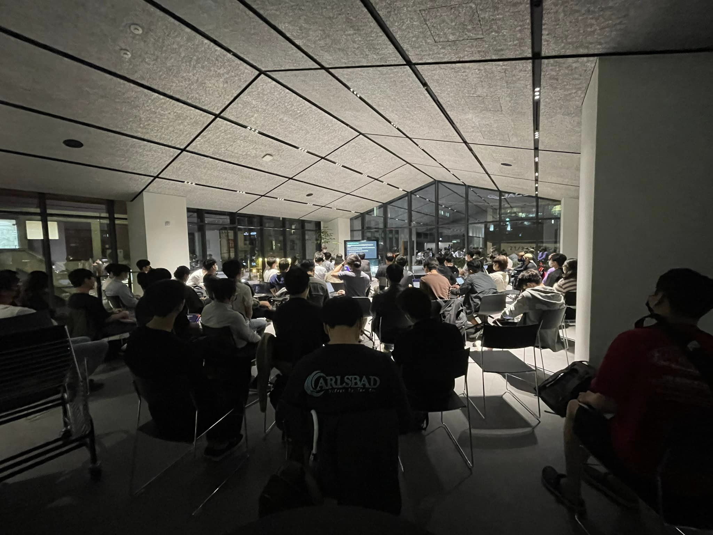

## 21차 모임 : [🏛AppSync 를 활용한 리얼타임 서버리스 아키텍쳐](https://www.meetup.com/ko-KR/awskrug/events/268107112/)
  - **일시** : 2020년 2월 13일
  - **발표자 : 발표주제 **
    - 김태우 (Solutions Architect, Classmethod, Inc.)
      - [🏛AppSync 를 활용한 리얼타임 서버리스 아키텍쳐](https://speakerdeck.com/twkiiim/appsyncreul-hwalyonghan-rieoltaim-seobeoriseu-akitegcyeo)
  - Lightning talk
    - 길병찬 - GraphQL의 장단점 소개. [3 factor app 소개](https://3factor.app/)

&nbsp;&nbsp;&nbsp;&nbsp;&nbsp;&nbsp;&nbsp;&nbsp;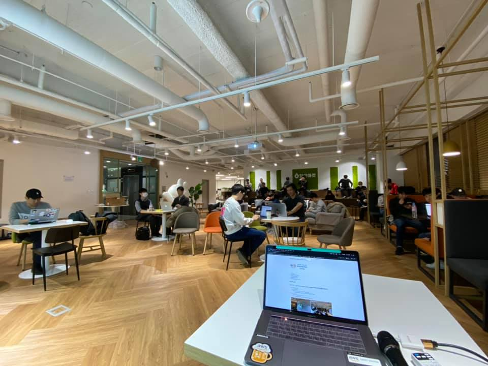

&nbsp;&nbsp;&nbsp;&nbsp;&nbsp;&nbsp;&nbsp;&nbsp;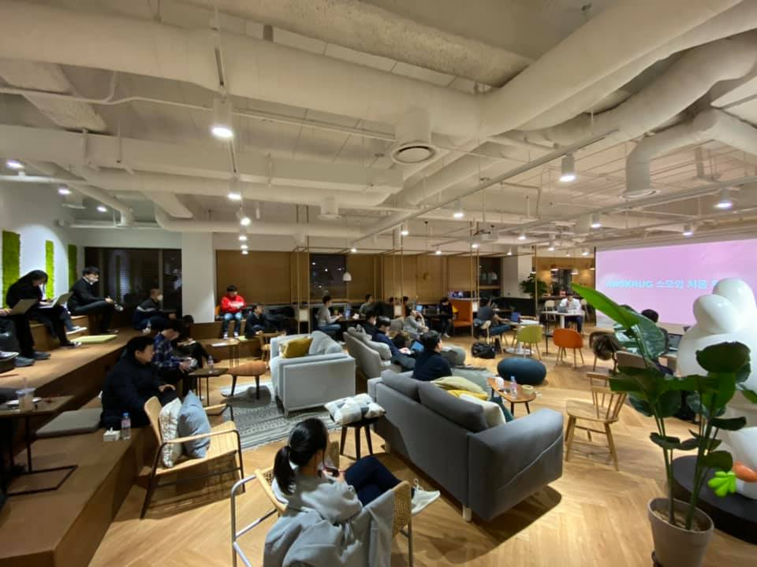

&nbsp;&nbsp;&nbsp;&nbsp;&nbsp;&nbsp;&nbsp;&nbsp;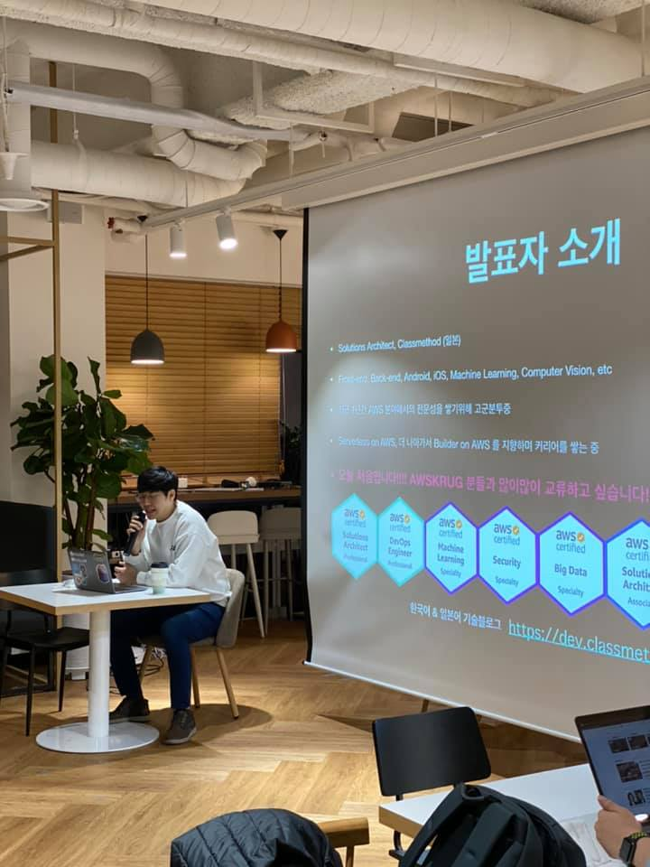

## 20차 모임 : [🔍Build serverless search engine(서버리스로 검색엔진 운영하기)](https://www.meetup.com/ko-KR/awskrug/events/267507852/)
  - **일시** : 2020년 1월 9일
  - **발표자 : 발표주제 **
    - 이상현 ( AWS Serverless Hero, Catch Fashion CTO )
      - [🔍Build serverless search engine(서버리스로 검색엔진 운영하기)](./res/20200109.pdf)
  - Lightning talk
    - 조용진 - Nori 형태소 분석기 운영 후기
    - 변규현 - Lambda Cold Start issue 및 Golang serverless 소개

&nbsp;&nbsp;&nbsp;&nbsp;&nbsp;&nbsp;&nbsp;&nbsp;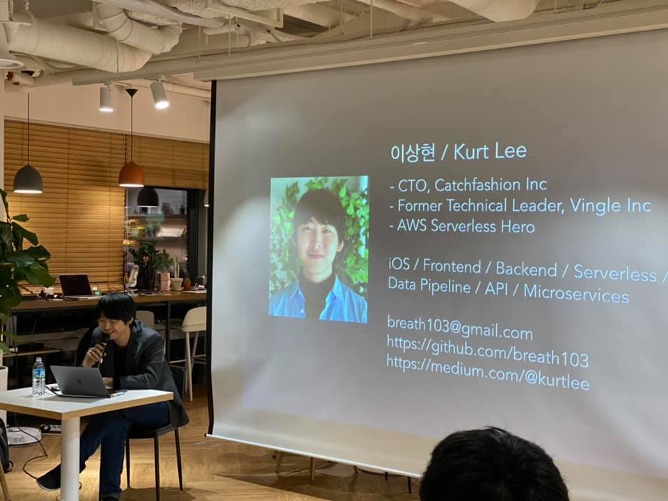

&nbsp;&nbsp;&nbsp;&nbsp;&nbsp;&nbsp;&nbsp;&nbsp;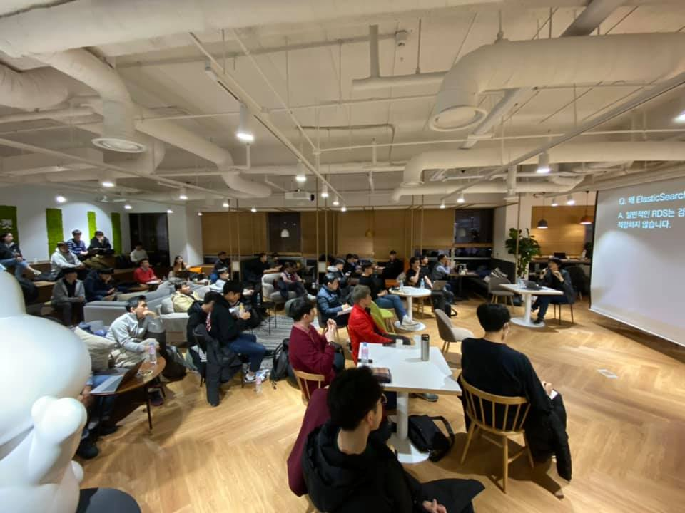

## 2019년 Meetups

  
펼쳐서 보기

## 19차 모임 : [Lambdaless and AWS CDK](https://www.meetup.com/ko-KR/awskrug/events/264948495/)
  - **일시** : 2019년 10월 22일
  - **발표자 : 발표주제 **
    - 이무열 (Software engineer, Vingle)
      - [Lambdaless and AWS CDK](https://www.slideshare.net/mooyoul/lambdaless-and-aws-cdk-191793017)
  - Lightning talk
    - 변규현 - Svelte 소개
    - 신재현 - Lambda를 활용한 Microservice 운영 경험
    - 신미르 - Javascript bundler 'rollup' 소개
    - 이상현 - Catch fashion 기술 소개
    - 박태성 - AWSKRUG 모임 소개
    - 박건상 - 내과의사가 1달만에 만들어 병원 2곳에서 운영하는 웹서비스

&nbsp;&nbsp;&nbsp;&nbsp;&nbsp;&nbsp;&nbsp;&nbsp;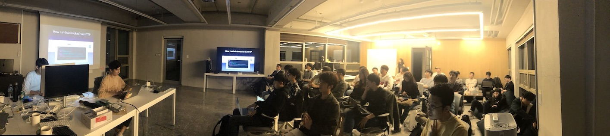

## 18차 모임 : [AWS Lambda 재활용과 Cold Start 제대로 이해하기 외 2편](https://www.meetup.com/ko-KR/awskrug/events/264233849/)
  - **일시** : 2019년 9월 4일
  - **발표자 : 발표주제**
    - 이상현 ( AWS Serverless Hero, Catch Fashion CTO )
      - [AWS Lambda 재활용과 Cold Start 제대로 이해하기 외 2편](/res/20190904.pdf)

&nbsp;&nbsp;&nbsp;&nbsp;&nbsp;&nbsp;&nbsp;&nbsp;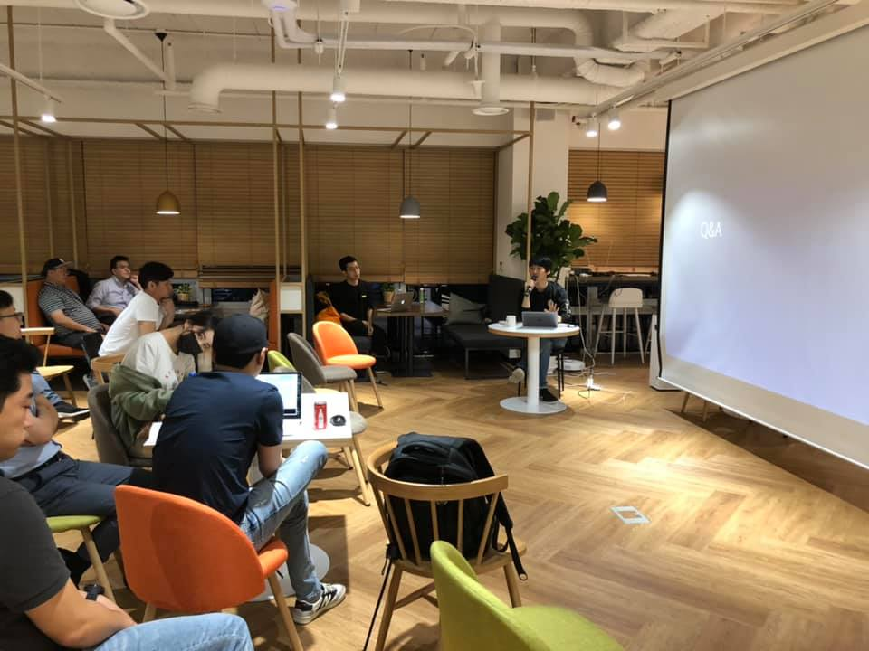

&nbsp;&nbsp;&nbsp;&nbsp;&nbsp;&nbsp;&nbsp;&nbsp;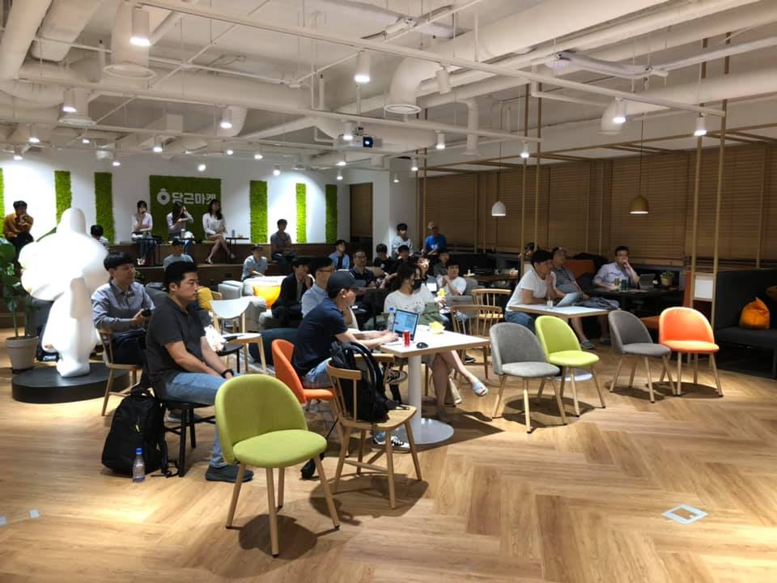

## 2019 서버리스 핸즈온 2차 : [Serverless Hands-on 2019 Part.2](https://www.meetup.com/ko-KR/awskrug/events/262459287/)
  - **일시** : 2019년 7월 13일
  - **발표자 : 발표주제**
    - 원지혁 ( 이리온컴퍼니, CTO )
      - 참고 자료: [서버리스 GraphQL API 개발, 운영기](/res/20190711-2.pdf)
      - Hands-on document : [https://github.com/tonyfromundefined/serverless-graphql-workshop](https://github.com/tonyfromundefined/serverless-graphql-workshop)

&nbsp;&nbsp;&nbsp;&nbsp;&nbsp;&nbsp;&nbsp;&nbsp;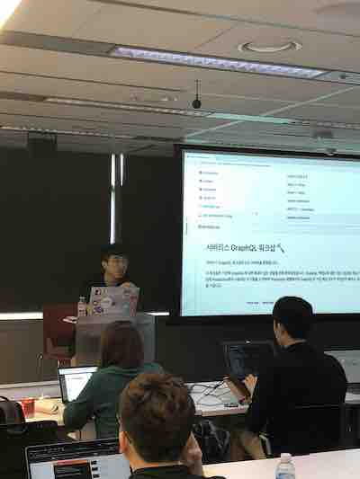

&nbsp;&nbsp;&nbsp;&nbsp;&nbsp;&nbsp;&nbsp;&nbsp;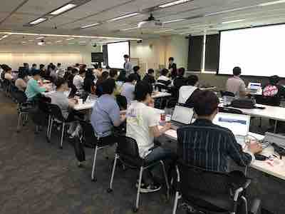

## 17차 모임 : [서버리스 GraphQL API 개발, 운영기 & Amazon Connect를 이용한 Outbound Call 서비스 개발하기](https://www.meetup.com/ko-KR/awskrug/events/262623844/)
  - **일시** : 2019년 7월 11일
  - **발표자 : 발표주제**
    - 원지혁 ( 이리온컴퍼니, CTO ) - [서버리스 GraphQL API 개발, 운영기](/res/20190711-2.pdf)
    - 현창훈 ( HB Smith ) - [Amazon Connect를 이용한 Outbound Call 서비스 개발하기](https://www.slideshare.net/changhoonhyun/amazon-connect-outbound-call)

&nbsp;&nbsp;&nbsp;&nbsp;&nbsp;&nbsp;&nbsp;&nbsp;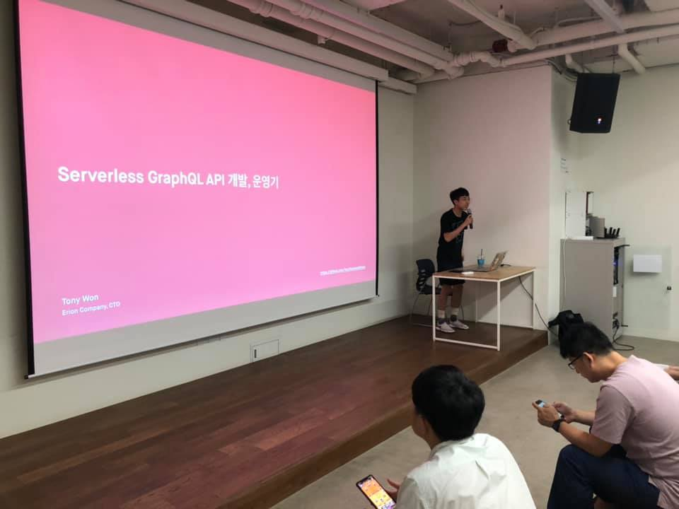

&nbsp;&nbsp;&nbsp;&nbsp;&nbsp;&nbsp;&nbsp;&nbsp;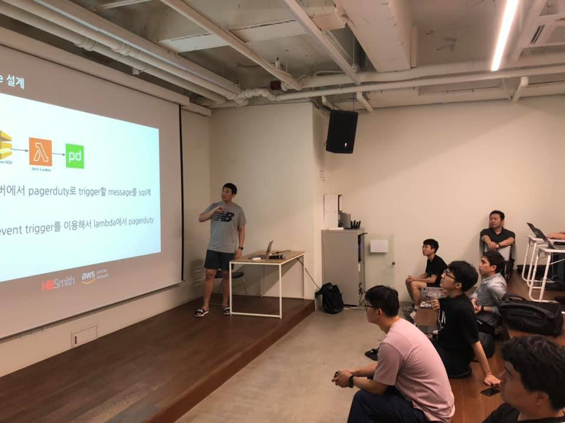

&nbsp;&nbsp;&nbsp;&nbsp;&nbsp;&nbsp;&nbsp;&nbsp;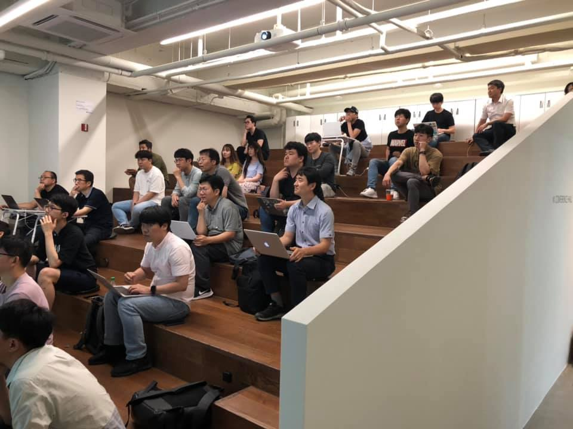

## 16차 모임 : [서버리스에 SPA앱 올리기 & 서버리스로 CI/CD 구축하기](https://www.meetup.com/ko-KR/awskrug/events/261824039/)
  - **일시** : 2019년 6월 12일
  - **발표자 : 발표주제**
    - 전창완 ( 데이터블 ) - [서버리스에 SPA앱 올리기]()
    - 이대명 ( 데이터블 ) - [서버리스로 CI/CD 구축하기]()

&nbsp;&nbsp;&nbsp;&nbsp;&nbsp;&nbsp;&nbsp;&nbsp;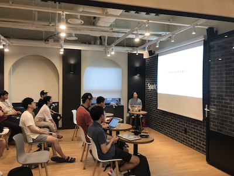

&nbsp;&nbsp;&nbsp;&nbsp;&nbsp;&nbsp;&nbsp;&nbsp;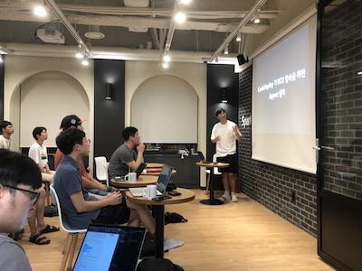

## 15차 모임 : [Black Belt Tips for Serverless and Container Development in AWS China](https://www.meetup.com/ko-KR/awskrug/events/260529921/)
  - **일시** : 2019년 5월 9일
  - **발표자 : 발표주제**
    - Pahud Hsieh (謝洪恩, Serverless Specialist SA, AWS)
      - 발표자료: [Black Belt Tips for Serverless and Container Development in AWS China](https://drive.google.com/open?id=1e0yHcKchG-vPcGn0y0ip9WOFbvl6GxSy)
      - Github: [https://github.com/pahud](https://github.com/pahud)

&nbsp;&nbsp;&nbsp;&nbsp;&nbsp;&nbsp;&nbsp;&nbsp;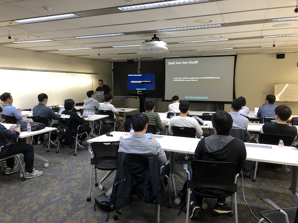

## 2019 서버리스 핸즈온 1차 : [Serverless Hands-on 2019 Part.1](https://www.meetup.com/ko-KR/awskrug/events/260465015/)
  - **일시** : 2019년 4월 27일
  - **발표자 : 발표주제**
    - 이상현 ( Technical Leader, Vingle Inc. / AWS Serverless Hero )
      - [발표자료(click)](https://www.icloud.com/keynote/0fL0mibQtgTg4ABkkZz91Qi0g#Handson)
      - [Github Repository(click)](https://github.com/breath103/serverless-websocket-example)
      - Demo: [https://fz5bsno29d.execute-api.ap-northeast-2.amazonaws.com/prod](https://fz5bsno29d.execute-api.ap-northeast-2.amazonaws.com/prod)

&nbsp;&nbsp;&nbsp;&nbsp;&nbsp;&nbsp;&nbsp;&nbsp;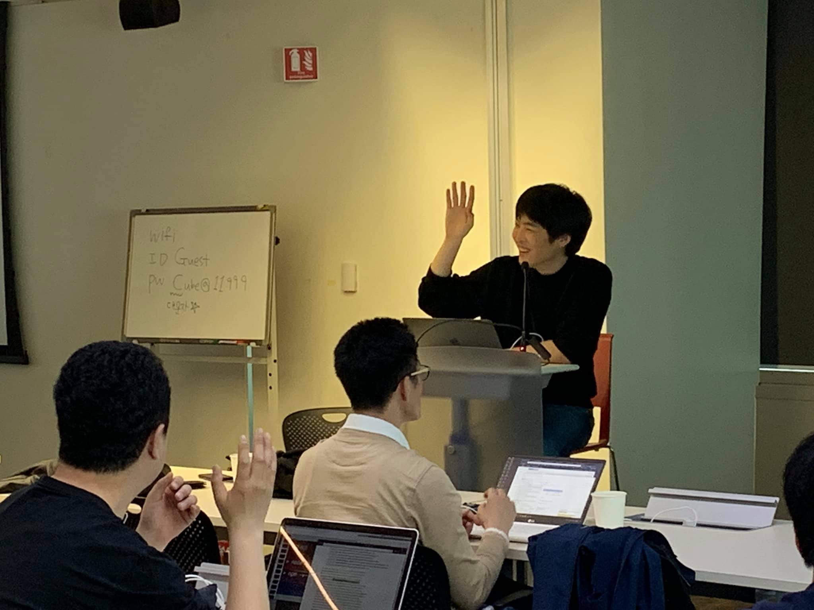

&nbsp;&nbsp;&nbsp;&nbsp;&nbsp;&nbsp;&nbsp;&nbsp;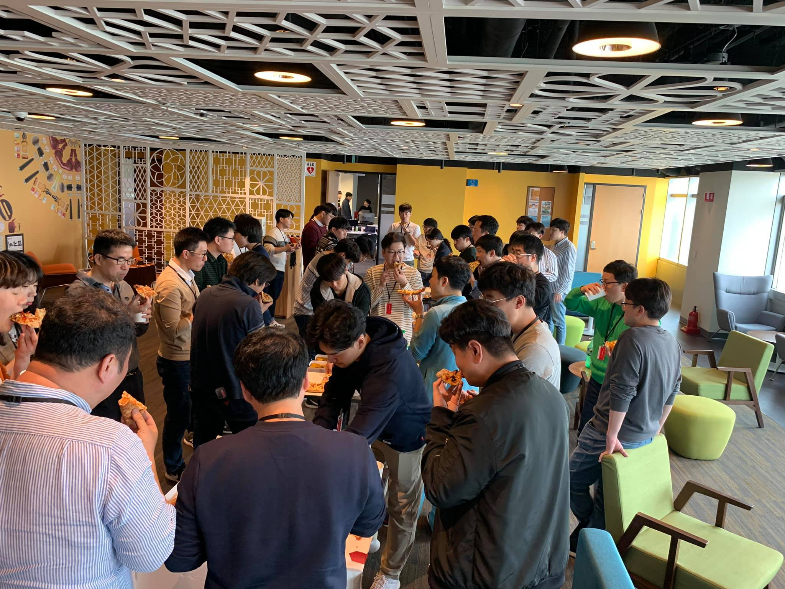

&nbsp;&nbsp;&nbsp;&nbsp;&nbsp;&nbsp;&nbsp;&nbsp;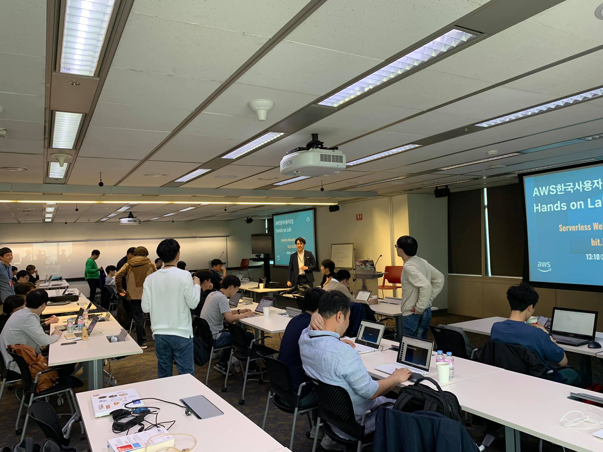

&nbsp;&nbsp;&nbsp;&nbsp;&nbsp;&nbsp;&nbsp;&nbsp;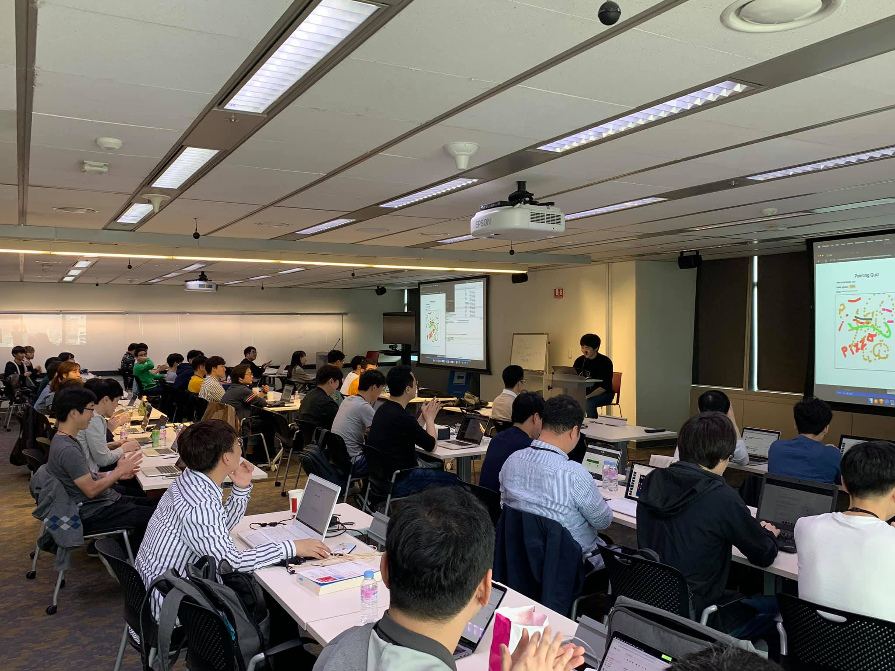

## 14차 모임 : [Lambda를 이용한 Serverless dynamic front web server에 대해 논해보아요 :)](https://www.meetup.com/ko-KR/awskrug/events/259582059/)
  - **일시** : 2019년 3월 14일
  - **발표자 : 발표주제**
    - 박찬민 ( Aart 개발자 / 서버리스모임 운영진 )
      - 발표자료: Lambda를 이용한 Serverless dynamic front web server에 대해 논해보아요😀
      - Demo: [https://github.com/ChanMinPark/lambda-nuxt](https://github.com/ChanMinPark/lambda-nuxt)

&nbsp;&nbsp;&nbsp;&nbsp;&nbsp;&nbsp;&nbsp;&nbsp;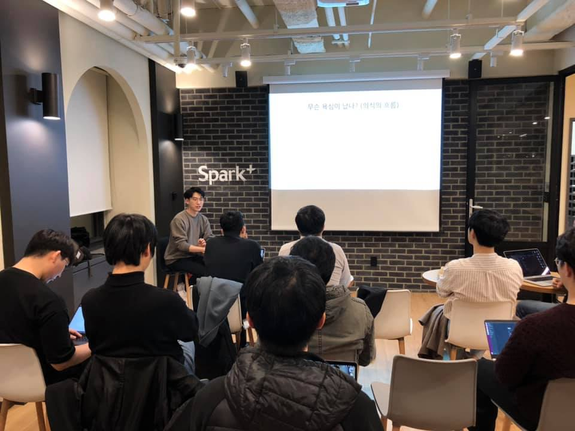

&nbsp;&nbsp;&nbsp;&nbsp;&nbsp;&nbsp;&nbsp;&nbsp;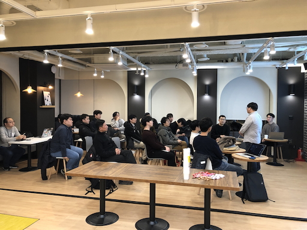

## 13차 모임 : [Python + AWS Lambda로 구현하는 초경량 웹 크롤러](https://www.meetup.com/ko-KR/awskrug/events/258867217/)
  - **일시** : 2019년 2월 14일
  - **발표자 : 발표주제**
    - 변규현 ( 모빌리스트, CTO ) - [Native addon를 포함하여 Node.js + Typescript 빌드 및 배포하기](https://www.slideshare.net/KyuhyunByun1/native-addon-nodejs-typescript-serverless)
    - 김승호 ( FA, 서버리스그룹 운영진 ) -  [Python + AWS Lambda로 구현하는 초경량 웹 크롤러](https://www.slideshare.net/SeunghoKim/awskrug-serverless-slideshare-133189054)

  &nbsp;&nbsp;&nbsp;&nbsp;&nbsp;&nbsp;&nbsp;&nbsp;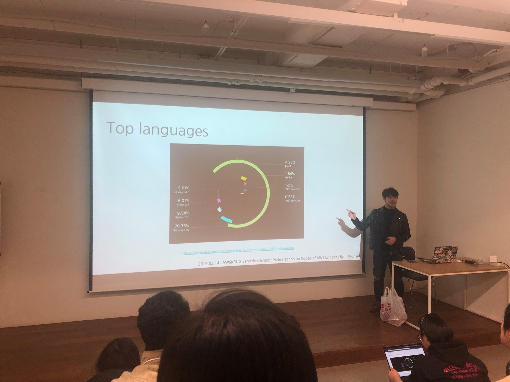
  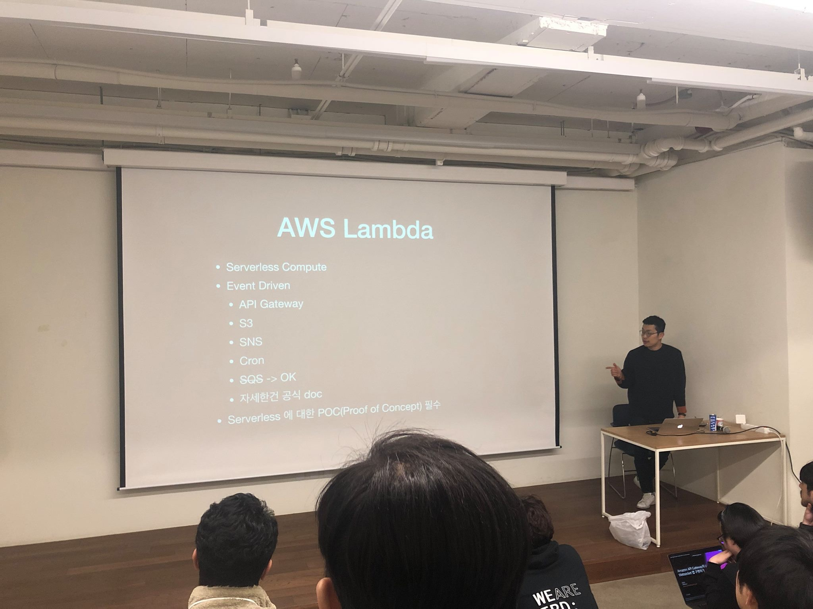

## 12차 모임 : [DevOps 0-10 : to The best from fundamental](https://www.meetup.com/ko-KR/awskrug/events/257772672/)
  - **일시** : 2019년 1월 10일
  - **발표자 : 발표주제**
    - 송주영 ( 삼성전자, DevOps engineer ) - DevOps 0-10 : to The best from fundamental

  &nbsp;&nbsp;&nbsp;&nbsp;&nbsp;&nbsp;&nbsp;&nbsp;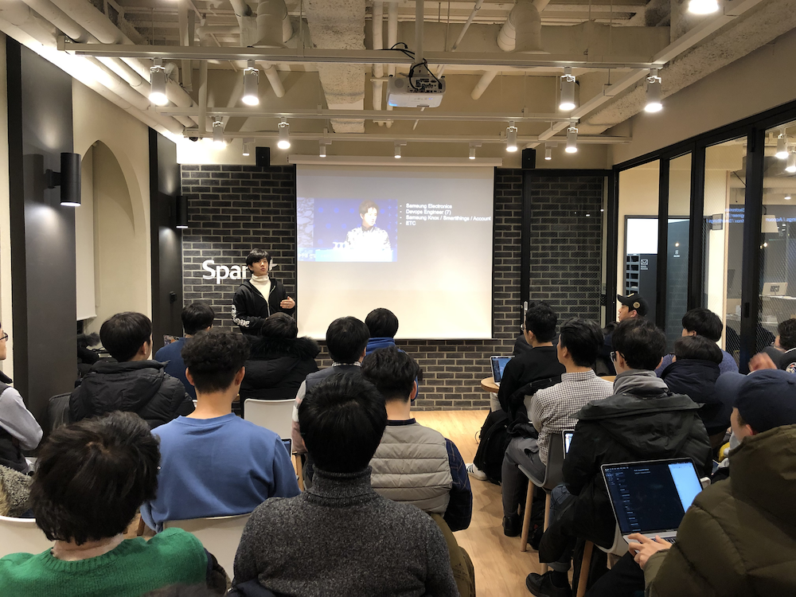
  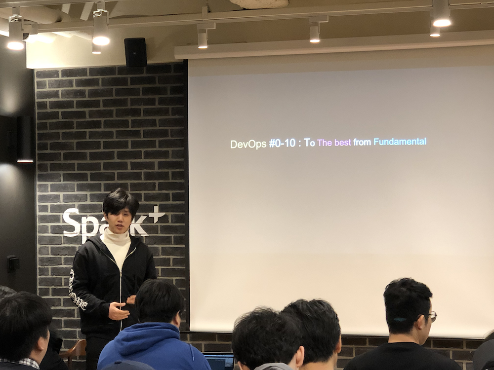

## 2018년 Meetups

  
펼쳐서 보기

## 11차 모임 : [AWSKRUG 연말 연합 소모임 및 송년회](https://www.meetup.com/ko-KR/awskrug/events/257050186/)
  - **일시** : 2018년 12월 20일
  - **발표자 : 발표주제**
    - 이무열 ( Vingle ) - [Serverless Programmable Voice](https://www.slideshare.net/mooyoul/serverless-programmable-voice)

&nbsp;&nbsp;&nbsp;&nbsp;&nbsp;&nbsp;&nbsp;&nbsp;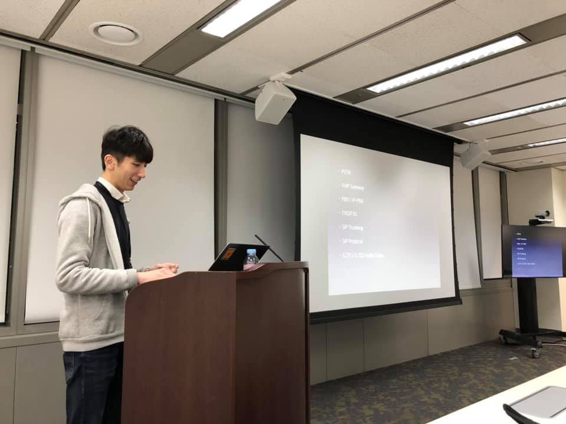

&nbsp;&nbsp;&nbsp;&nbsp;&nbsp;&nbsp;&nbsp;&nbsp;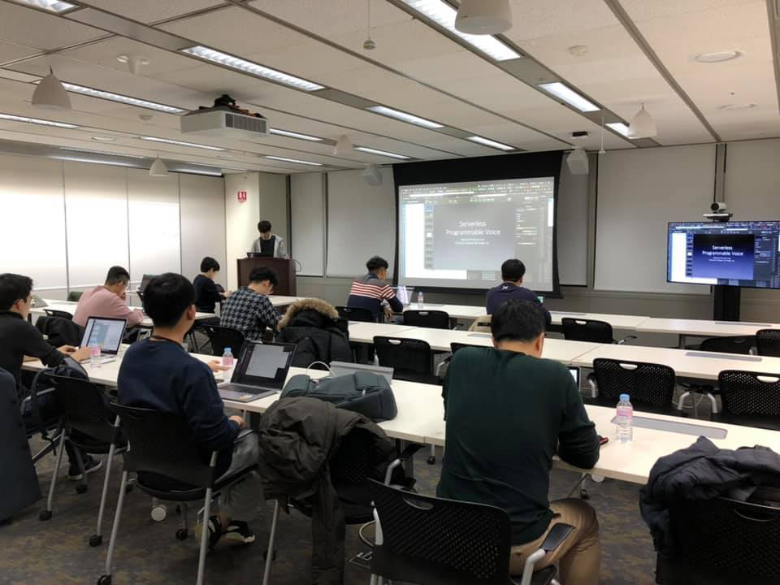

&nbsp;&nbsp;&nbsp;&nbsp;&nbsp;&nbsp;&nbsp;&nbsp;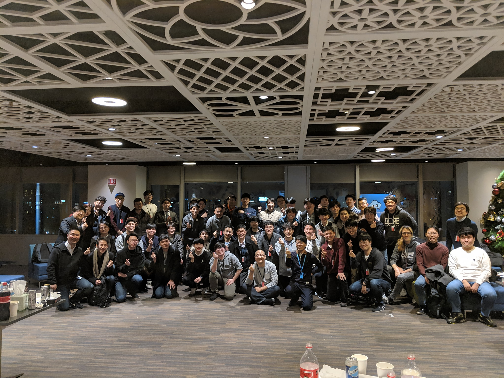

## 10차 모임 : [Serverless로 하는 Content Recommendation (Collaborative Filtering)](https://www.meetup.com/ko-KR/awskrug/events/255959371/)
  - **일시** : 2018년 11월 08일
  - **발표자 : 발표주제**
    - 이상현 ( Vingle, Tech lead ) - [Serverless로 하는 Content Recommendation (Collaborative Filtering)](https://www.icloud.com/keynote/0SG91tDeKl4iff9UGVkbCnCUw?fbclid=IwAR3hfu05tW6f96jefTs1tpcwaHOa3REuSmgR3ZGz49VBQAo3pgypF_LtJzU#Serverless_Content_Recommendation)

&nbsp;&nbsp;&nbsp;&nbsp;&nbsp;&nbsp;&nbsp;&nbsp;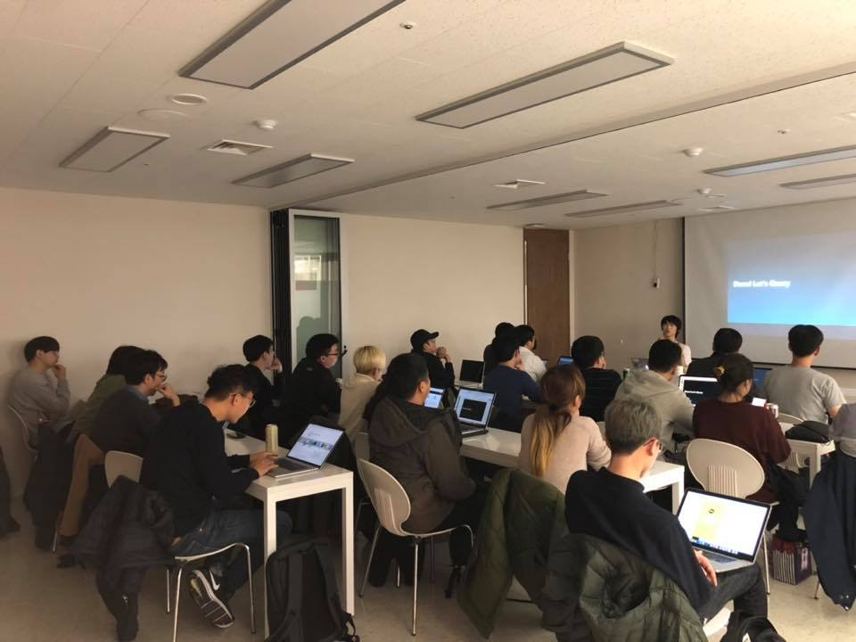

## 9차 모임 : [로그 분석기 Serverless Architecture 로 구축하기 & 포털 검색어 순위 수집 및 분석하기](https://www.meetup.com/ko-KR/awskrug/events/255154810/)
  - **일시** : 2018년 10월 11일
  - **발표자 : 발표주제**
    - 황정아 - [로그 분석기 Serverless Architecture 로 구축하기](https://docs.google.com/presentation/d/1BViD5W8QooQYMiitKByqvbWgQw0KN85jTHIJVXNKPXo)
    - 변규현 - [포털 검색어 순위 수집 및 분석 후기](https://www.slideshare.net/KyuhyunByun1/ss-119161567)

&nbsp;&nbsp;&nbsp;&nbsp;&nbsp;&nbsp;&nbsp;&nbsp;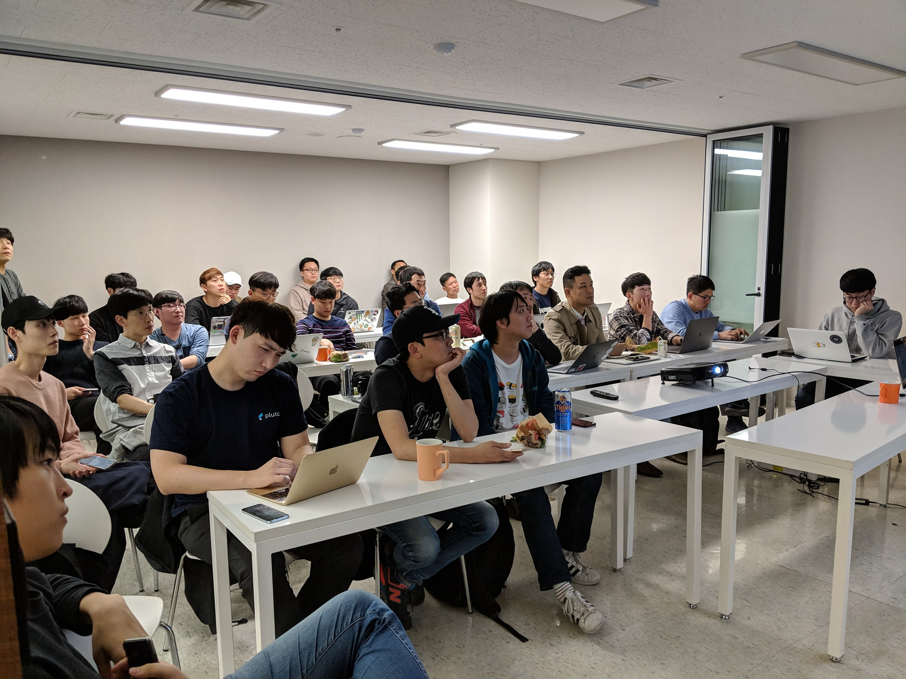

## 8차 모임 : [AWSKRUG 통합소모임](https://www.meetup.com/ko-KR/awskrug/events/254585156/)
  - **일시** : 2018년 9월 19일
  - **발표자 : 발표주제**
    - 유은총 - [Slack과 Rust로 Amazon ECS에 서비스 배포하기](https://www.slideshare.net/eunchongyu/slack-rust-amazon-ecs)
    - 김진용 - [스타트업을 위한 지속가능한 컨텐츠 관리를 위한 아키텍처 ](https://www.slideshare.net/ssuser6050e4/ss-119165106)
    - 윤제상 - [AWS Aurora로의 안전한 마이그레이션 경험 공유 ](https://www.slideshare.net/jesangyoon/amazon-aurora-migration)

&nbsp;&nbsp;&nbsp;&nbsp;&nbsp;&nbsp;&nbsp;&nbsp;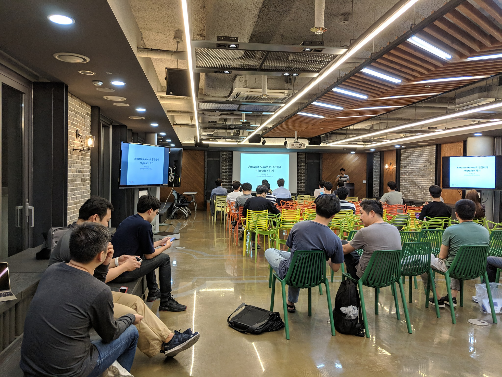

## 2018 서버리스 핸즈온 3차 : [Serverless Hands-on](https://www.meetup.com/ko-KR/awskrug/events/252838800/)
  - **일시** : 2018년 8월 11일
  - **발표자 : 발표주제**
    - 신재현(sinsky), 윤평호(mosesyoon) - [쉽고 빠르게 서버리스 데이터레이크 구축하기](https://github.com/awskrug/handson-labs-2018/tree/master/Serverless/3_serverless_datalake)

&nbsp;&nbsp;&nbsp;&nbsp;&nbsp;&nbsp;&nbsp;&nbsp;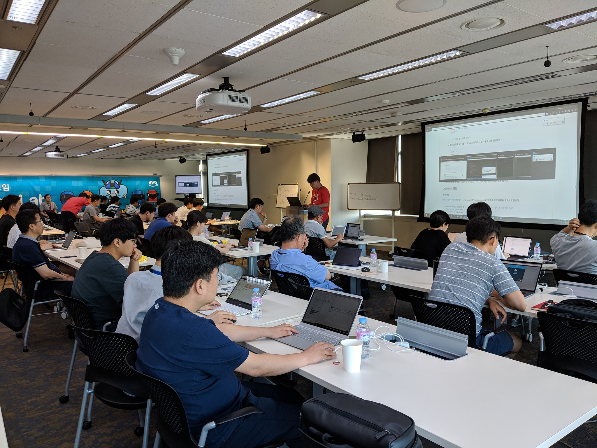

&nbsp;&nbsp;&nbsp;&nbsp;&nbsp;&nbsp;&nbsp;&nbsp;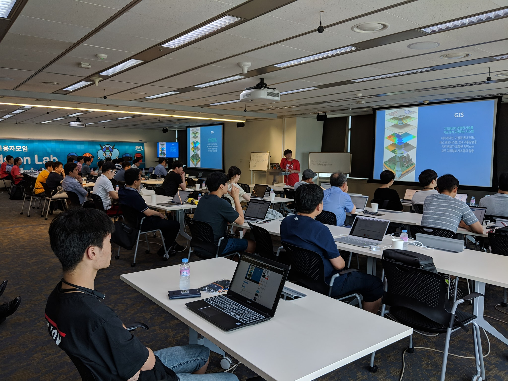

## 2018 서버리스 핸즈온 2차 : [Serverless Hands-on](https://www.meetup.com/ko-KR/awskrug/events/252365126/)
  - **일시** : 2018년 7월 28일
  - **발표자 : 발표주제**
    - 현창훈 - [Serverless Application의 운영과 배포](https://github.com/awskrug/handson-labs-2018/tree/master/Serverless)

&nbsp;&nbsp;&nbsp;&nbsp;&nbsp;&nbsp;&nbsp;&nbsp;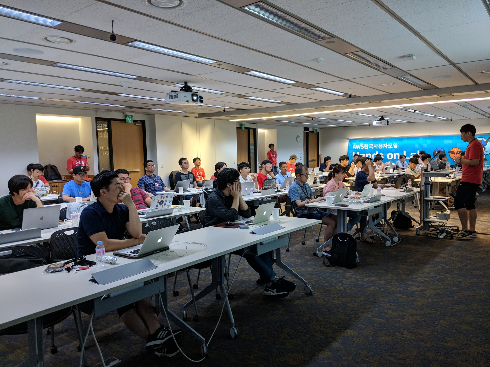

&nbsp;&nbsp;&nbsp;&nbsp;&nbsp;&nbsp;&nbsp;&nbsp;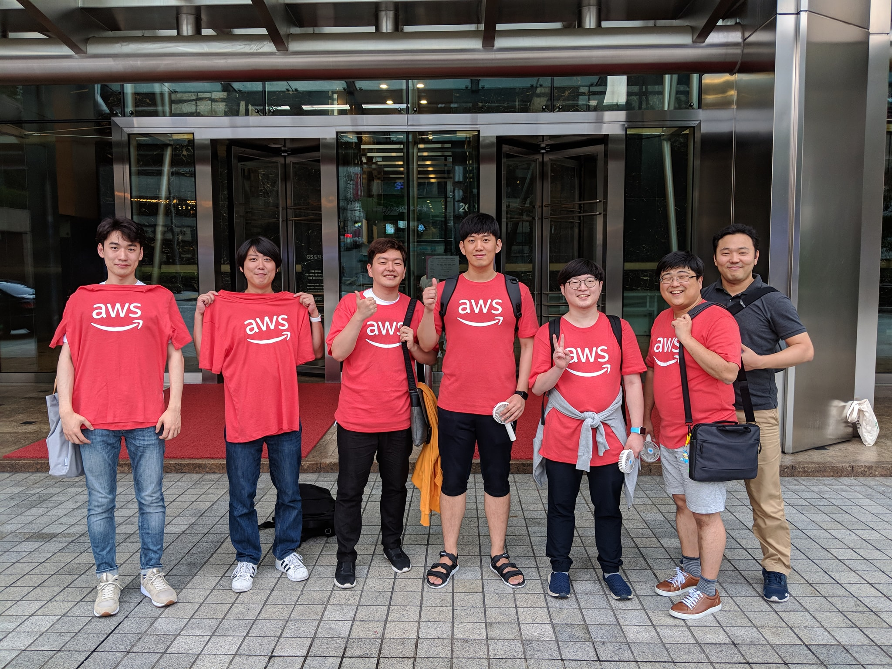

## 7차 모임 : [AWS Lambda 병렬 처리를 통한 PDF to Image 사용기 & Serverless 개발 고군 분투기](https://www.meetup.com/ko-KR/awskrug/events/252147208/)
  - **일시** : 2018년 7월 12일
  - **발표자 : 발표주제**
    - 고윤호 - AWS Lambda 병렬 처리를 통한 PDF to Image 사용기
      - [https://github.com/witherion/PdfToImageOnLambda](https://github.com/witherion/PdfToImageOnLambda)
    - 이재성 - AWS 람다 및 Serverless Framework 사용하면서 겪었던 경험 공유

&nbsp;&nbsp;&nbsp;&nbsp;&nbsp;&nbsp;&nbsp;&nbsp;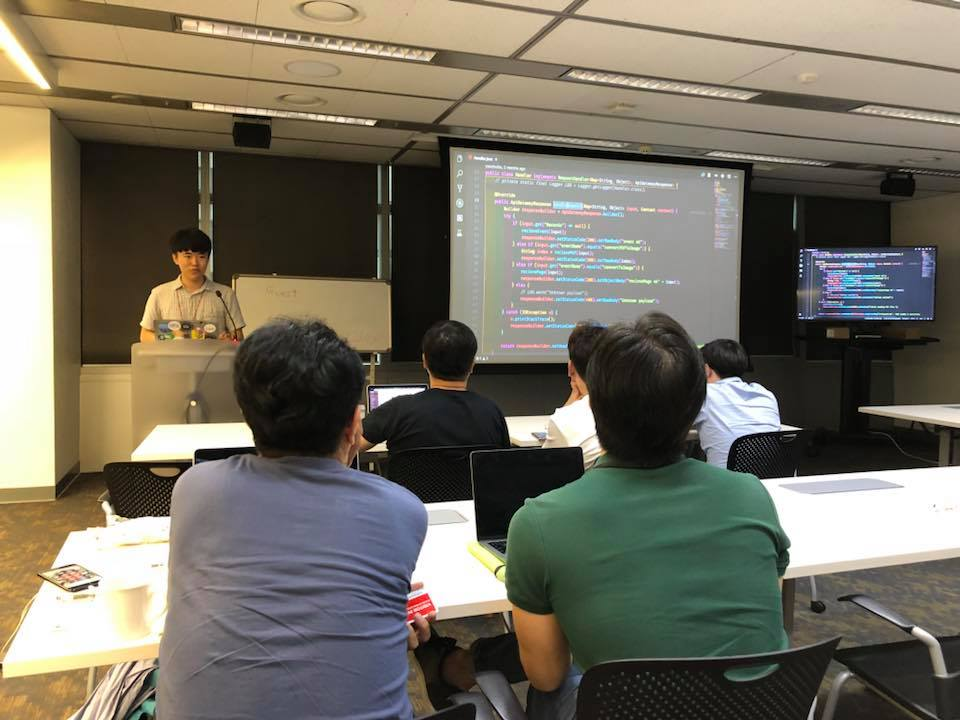

&nbsp;&nbsp;&nbsp;&nbsp;&nbsp;&nbsp;&nbsp;&nbsp;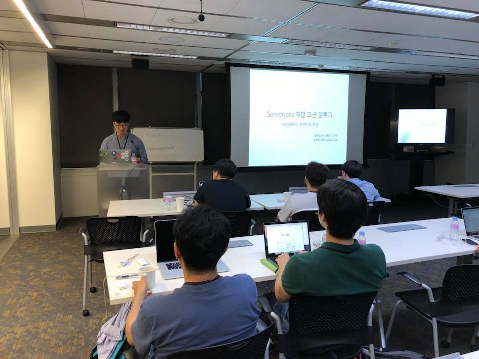

## 2018 서버리스 핸즈온 1차 : [Serverless Hands-on](https://www.meetup.com/ko-KR/awskrug/events/251326459/)
  - **일시** : 2018년 6월 30일
  - **발표자 : 발표주제**
    - 변규현 - [손쉽게 시작하는 Serverless Architecture](https://github.com/awskrug/handson-labs-2018/tree/master/Serverless/1_WebApp-Crawler)

&nbsp;&nbsp;&nbsp;&nbsp;&nbsp;&nbsp;&nbsp;&nbsp;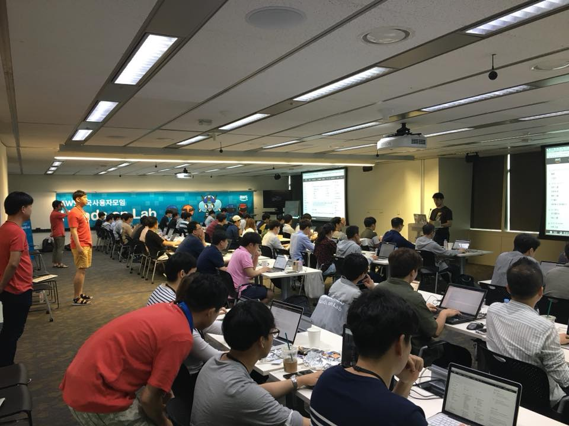

## 6차 모임 : [오늘 날씨 앱의 변천사 및 개발 방향성에 대한 고민 & 서버리스 아키텍처 테라폼으로 관리하기](https://www.meetup.com/ko-KR/awskrug/events/251057806/)
  - **일시** : 2018년 6월 14일
  - **발표자 : 발표주제**
    - 김동환 - 오늘 날씨 앱의 변천사 및 개발 방향성에 대한 고민과 Restful API를 MQTT(AWS IoT)로 변경하기
    - 유정열 - [서버리스 아키텍처 테라폼으로 관리하기](https://github.com/nalbam/docs/blob/master/201806/Serverless/README.md)

&nbsp;&nbsp;&nbsp;&nbsp;&nbsp;&nbsp;&nbsp;&nbsp;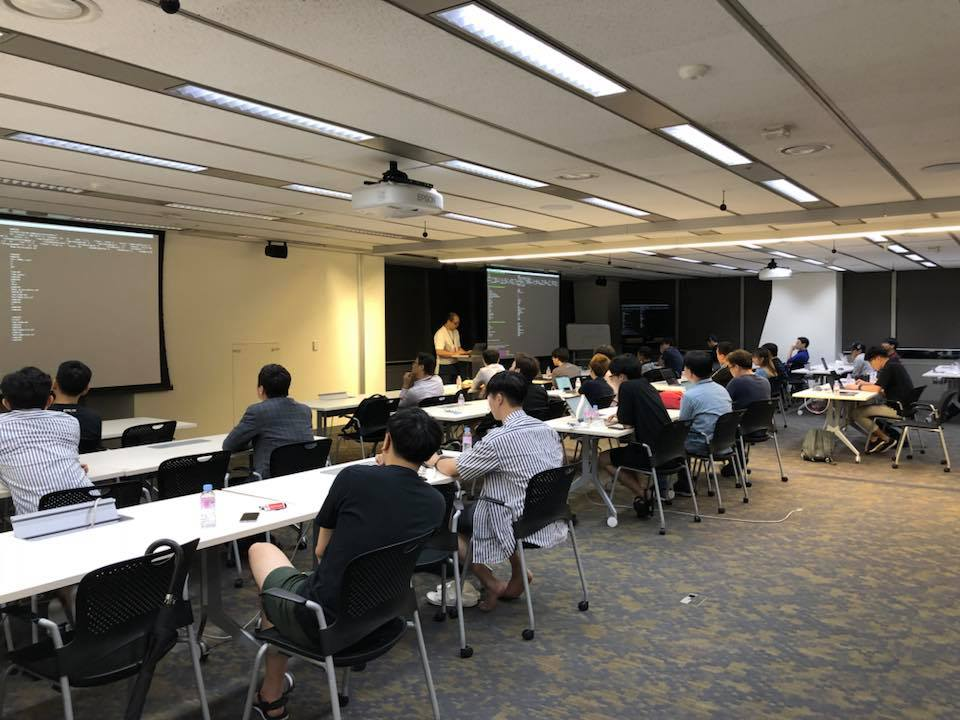

&nbsp;&nbsp;&nbsp;&nbsp;&nbsp;&nbsp;&nbsp;&nbsp;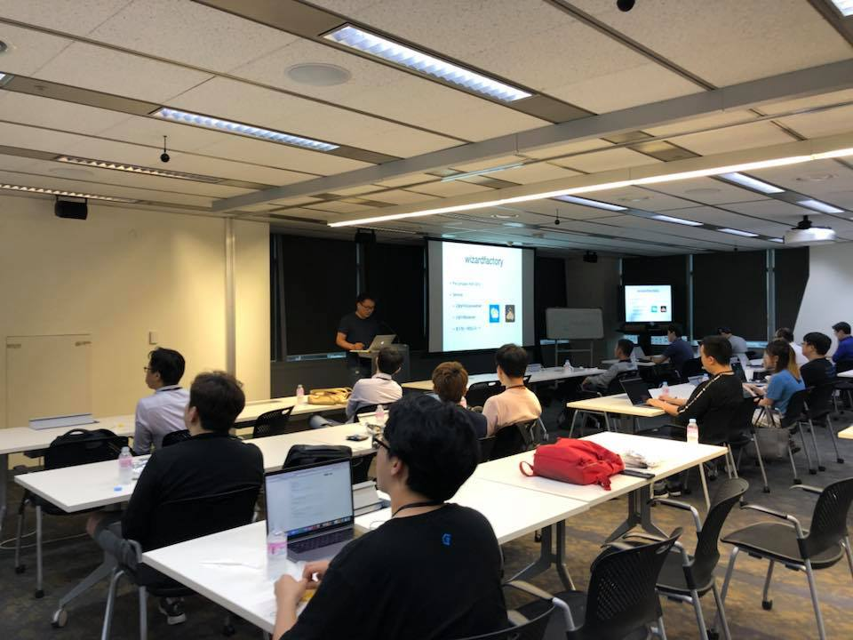

## 5차 모임: [Serverless Architecture의 Worst Practice + GraphQL Caching!](https://www.meetup.com/ko-KR/awskrug/events/250127504/)
  - **일시** : 2018년 5월 10일
  - **발표자 : 발표주제**
    - 신재현 - [Serverless Architecture의 Worst Practice](https://www.slideshare.net/wesky93/worstpractice-of-serverless-96623786)

&nbsp;&nbsp;&nbsp;&nbsp;&nbsp;&nbsp;&nbsp;&nbsp;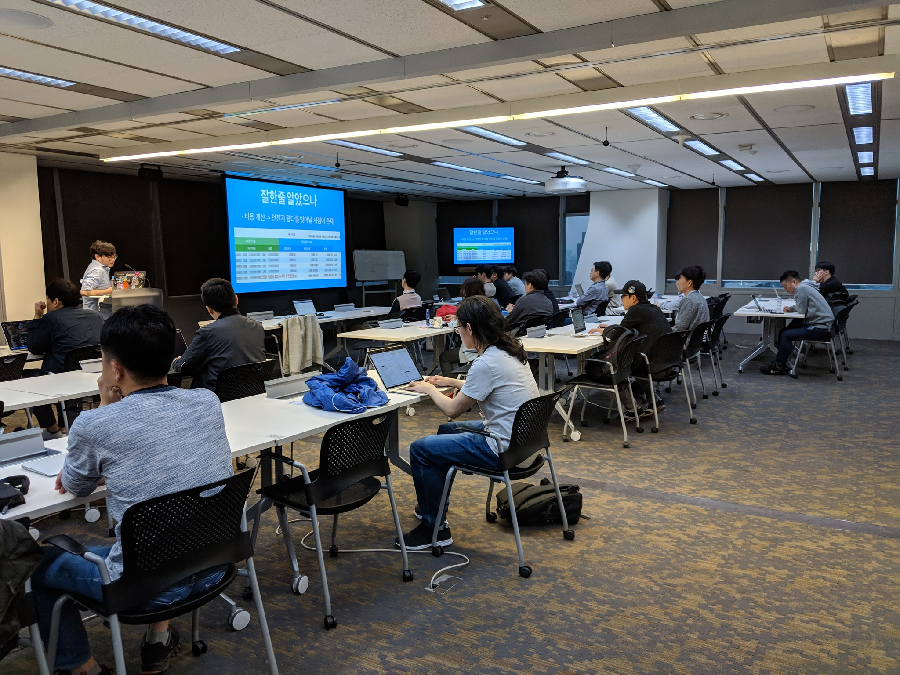

&nbsp;&nbsp;&nbsp;&nbsp;&nbsp;&nbsp;&nbsp;&nbsp;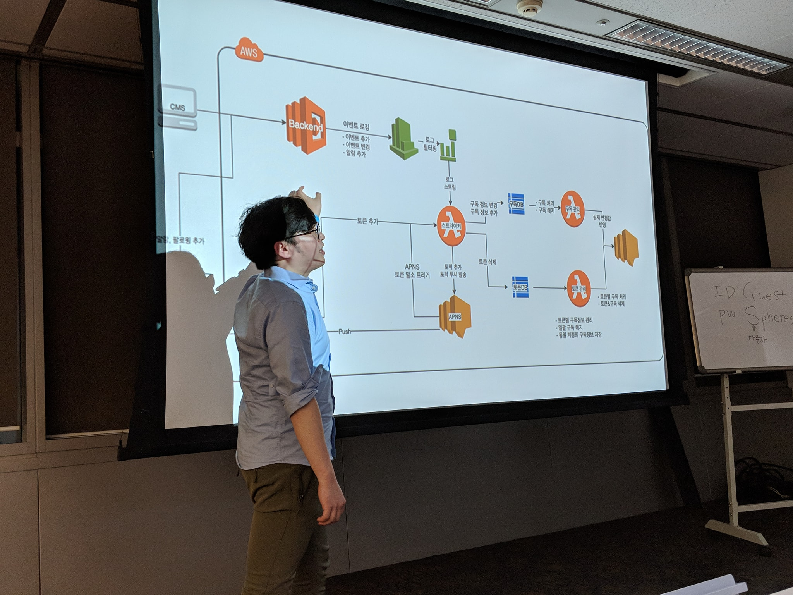

## 4차 모임: [스타트업의 서버리스 아키텍처 도입기](https://www.meetup.com/ko-KR/awskrug/events/csbrnpyxgbkb/)
  - **일시** : 2018년 4월 12일
  - **발표자 : 발표주제**
    - 변규현 - [기존 ALB - EC2 환경에서 API Gateway - Lambda 로 전환한 경험 공유](https://www.slideshare.net/KyuhyunByun1/albec2-to-api-gateway-lambda)

&nbsp;&nbsp;&nbsp;&nbsp;&nbsp;&nbsp;&nbsp;&nbsp;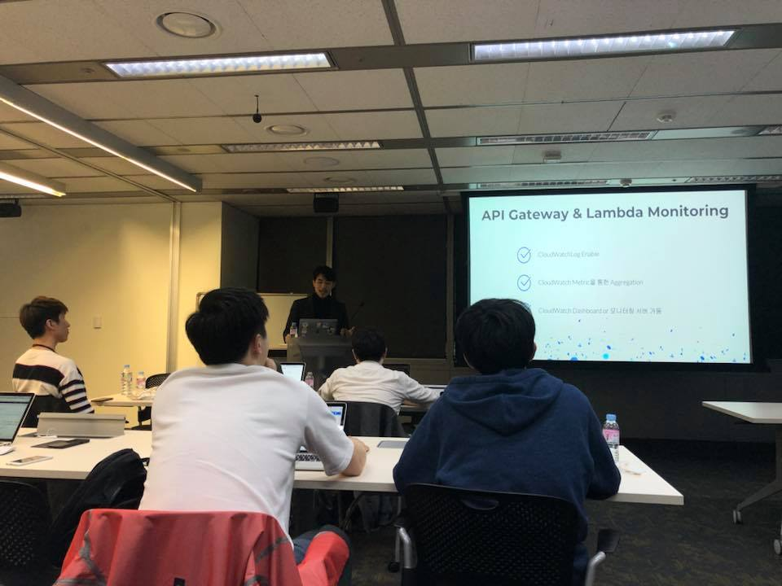

## 3차 모임: [AWSLabs의 서버리스 워크샵 실습 - Image Processing](https://www.meetup.com/ko-KR/awskrug/events/244688432/)
  - **일시** : 2017년 11월 6일
  - **발표자 : 발표주제**
    - 김현민 - [Wild Rydes 서버리스 워크샵 - 이미지 프로세싱](https://github.com/awskrug/aws-serverless-workshops/tree/master/ImageProcessing)

## 2차 모임: [AWSLabs의 서버리스 워크샵 실습 - DevOps](https://www.meetup.com/ko-KR/awskrug/events/244106093/)
  - **일시** : 2017년 10월 24일
  - **발표자 : 발표주제**
    - 김현민 - [Wild Rydes 서버리스 워크샵 - 데브옵스](https://github.com/awskrug/aws-serverless-workshops/tree/master/DevOps)

## 1차 모임: [AWSLabs의 서버리스 워크샵 실습 - 데이터 프로세싱](https://www.meetup.com/ko-KR/awskrug/events/243699559/)
  - **일시** : 2017년 10월 11일
  - **발표자 : 발표주제**
    - 김현민 - [Wild Rydes 서버리스 워크샵 - 데이터 프로세싱](https://github.com/awskrug/aws-serverless-workshops/tree/master/DataProcessing)

&nbsp;&nbsp;&nbsp;&nbsp;&nbsp;&nbsp;&nbsp;&nbsp;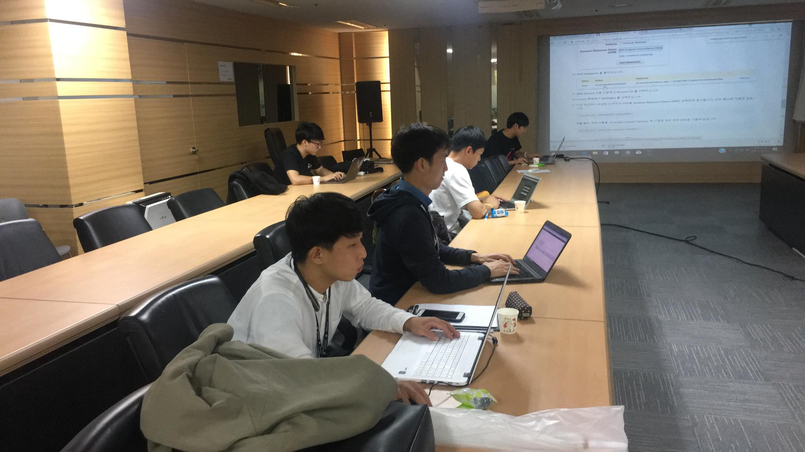

