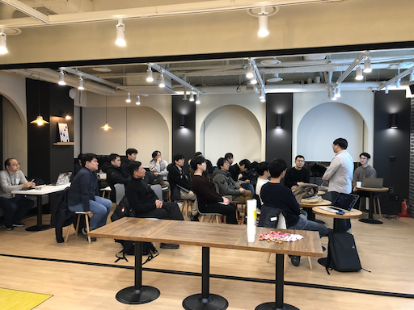

# AWSKRUG Serverless Group

- since 2017
- [AWSKRUG Facebook Link](https://www.facebook.com/groups/awskrug/)
- [AWSKRUG Meetup Link](https://www.meetup.com/ko-KR/awskrug/)
- [AWSKRUG Web Site](http://www.awskr.org/)
- [AWSKRUG Slack Channel LInk](http://awskrug.slack.com)

# Meetups

## 2019 서버리스 핸즈온 1차 : [Serverless Hands-on](https://www.meetup.com/ko-KR/awskrug/events/260465015/)
  - **일시** : 2019년 4월 27일
  - **발표자 : 발표주제**
    - 이상현 ( Technical Leader, Vingle Inc. / AWS Serverless Hero )
      - [발표자료(click)](https://www.icloud.com/keynote/0fL0mibQtgTg4ABkkZz91Qi0g#Handson)
      - [Github Repository(click)](https://github.com/breath103/serverless-websocket-example)
      - Demo: [https://fz5bsno29d.execute-api.ap-northeast-2.amazonaws.com/prod](https://fz5bsno29d.execute-api.ap-northeast-2.amazonaws.com/prod)

  &nbsp;&nbsp;&nbsp;&nbsp;&nbsp;&nbsp;&nbsp;&nbsp;
  

## 14차 모임 : [Lambda를 이용한 Serverless dynamic front web server에 대해 논해보아요 :)](https://www.meetup.com/ko-KR/awskrug/events/259582059/)
  - **일시** : 2019년 3월 14일
  - **발표자 : 발표주제**
    - 박찬민 ( Aart 개발자 / 서버리스모임 운영진 )
      - 발표자료: [Lambda를 이용한 Serverless dynamic front web server에 대해 논해보아요😀 (업데이트 예정)]()
      - Demo: [https://github.com/ChanMinPark/lambda-nuxt](https://github.com/ChanMinPark/lambda-nuxt)

  &nbsp;&nbsp;&nbsp;&nbsp;&nbsp;&nbsp;&nbsp;&nbsp;
  

## 13차 모임 : [Python + AWS Lambda로 구현하는 초경량 웹 크롤러](https://www.meetup.com/ko-KR/awskrug/events/258867217/)
  - **일시** : 2019년 2월 14일
  - **발표자 : 발표주제**
    - 변규현 ( 모빌리스트, CTO ) - [Native addon를 포함하여 Node.js + Typescript 빌드 및 배포하기](https://www.slideshare.net/KyuhyunByun1/native-addon-nodejs-typescript-serverless)
    - 김승호 ( FA, 서버리스그룹 운영진 ) -  [Python + AWS Lambda로 구현하는 초경량 웹 크롤러](https://www.slideshare.net/SeunghoKim/awskrug-serverless-slideshare-133189054)

  &nbsp;&nbsp;&nbsp;&nbsp;&nbsp;&nbsp;&nbsp;&nbsp;
  

## 12차 모임 : [DevOps 0-10 : to The best from fundamental](https://www.meetup.com/ko-KR/awskrug/events/257772672/)
  - **일시** : 2019년 1월 10일
  - **발표자 : 발표주제**
    - 송주영 ( 삼성전자, DevOps engineer ) - DevOps 0-10 : to The best from fundamental

  &nbsp;&nbsp;&nbsp;&nbsp;&nbsp;&nbsp;&nbsp;&nbsp;
  

## 11차 모임 : [AWSKRUG 연말 연합 소모임 및 송년회](https://www.meetup.com/ko-KR/awskrug/events/257050186/)
  - **일시** : 2018년 12월 20일
  - **발표자 : 발표주제**
    - 이무열 ( Vingle ) - [Serverless Programmable Voice](https://www.slideshare.net/mooyoul/serverless-programmable-voice)

  &nbsp;&nbsp;&nbsp;&nbsp;&nbsp;&nbsp;&nbsp;&nbsp;
  

  &nbsp;&nbsp;&nbsp;&nbsp;&nbsp;&nbsp;&nbsp;&nbsp;

## 10차 모임 : [Serverless로 하는 Content Recommendation (Collaborative Filtering)](https://www.meetup.com/ko-KR/awskrug/events/255959371/)
  - **일시** : 2018년 11월 08일
  - **발표자 : 발표주제**
    - 이상현 ( Vingle, Tech lead ) - [Serverless로 하는 Content Recommendation (Collaborative Filtering)](https://www.icloud.com/keynote/0SG91tDeKl4iff9UGVkbCnCUw?fbclid=IwAR3hfu05tW6f96jefTs1tpcwaHOa3REuSmgR3ZGz49VBQAo3pgypF_LtJzU#Serverless_Content_Recommendation)

  &nbsp;&nbsp;&nbsp;&nbsp;&nbsp;&nbsp;&nbsp;&nbsp;

## 9차 모임 : [로그 분석기 Serverless Architecture 로 구축하기 & 포털 검색어 순위 수집 및 분석하기](https://www.meetup.com/ko-KR/awskrug/events/255154810/)
  - **일시** : 2018년 10월 11일
  - **발표자 : 발표주제**
    - 황정아 - [로그 분석기 Serverless Architecture 로 구축하기](https://docs.google.com/presentation/d/1BViD5W8QooQYMiitKByqvbWgQw0KN85jTHIJVXNKPXo)
    - 변규현 - [포털 검색어 순위 수집 및 분석 후기](https://www.slideshare.net/KyuhyunByun1/ss-119161567)

  &nbsp;&nbsp;&nbsp;&nbsp;&nbsp;&nbsp;&nbsp;&nbsp;

## 8차 모임 : [AWSKRUG 통합소모임](https://www.meetup.com/ko-KR/awskrug/events/254585156/)
  - **일시** : 2018년 9월 19일
  - **발표자 : 발표주제**
    - 유은총 - [Slack과 Rust로 Amazon ECS에 서비스 배포하기](https://www.slideshare.net/eunchongyu/slack-rust-amazon-ecs)
    - 김진용 - [스타트업을 위한 지속가능한 컨텐츠 관리를 위한 아키텍처 ](https://www.slideshare.net/ssuser6050e4/ss-119165106)
    - 윤제상 - [AWS Aurora로의 안전한 마이그레이션 경험 공유 ](https://www.slideshare.net/jesangyoon/amazon-aurora-migration)

  &nbsp;&nbsp;&nbsp;&nbsp;&nbsp;&nbsp;&nbsp;&nbsp;

## 2018 서버리스 핸즈온 3차 : [Serverless Hands-on](https://www.meetup.com/ko-KR/awskrug/events/252838800/)
  - **일시** : 2018년 8월 11일
  - **발표자 : 발표주제**
    - 신재현(sinsky), 윤평호(mosesyoon) - [쉽고 빠르게 서버리스 데이터레이크 구축하기](https://github.com/awskrug/handson-labs-2018/tree/master/Serverless/3_serverless_datalake)

  &nbsp;&nbsp;&nbsp;&nbsp;&nbsp;&nbsp;&nbsp;&nbsp;
  

## 2018 서버리스 핸즈온 2차 : [Serverless Hands-on](https://www.meetup.com/ko-KR/awskrug/events/252365126/)
  - **일시** : 2018년 7월 28일
  - **발표자 : 발표주제**
    - 현창훈 - [Serverless Application의 운영과 배포](https://github.com/awskrug/handson-labs-2018/tree/master/Serverless)

  &nbsp;&nbsp;&nbsp;&nbsp;&nbsp;&nbsp;&nbsp;&nbsp;
  

## 7차 모임 : [AWS Lambda 병렬 처리를 통한 PDF to Image 사용기 & Serverless 개발 고군 분투기](https://www.meetup.com/ko-KR/awskrug/events/252147208/)
  - **일시** : 2018년 7월 12일
  - **발표자 : 발표주제**
    - 고윤호 - AWS Lambda 병렬 처리를 통한 PDF to Image 사용기
      - [https://github.com/witherion/PdfToImageOnLambda](https://github.com/witherion/PdfToImageOnLambda)
    - 이재성 - AWS 람다 및 Serverless Framework 사용하면서 겪었던 경험 공유
  
  &nbsp;&nbsp;&nbsp;&nbsp;&nbsp;&nbsp;&nbsp;&nbsp;
  

## 2018 서버리스 핸즈온 1차 : [Serverless Hands-on](https://www.meetup.com/ko-KR/awskrug/events/251326459/)
  - **일시** : 2018년 6월 30일
  - **발표자 : 발표주제**
    - 변규현 - [손쉽게 시작하는 Serverless Architecture](https://github.com/awskrug/handson-labs-2018/tree/master/Serverless/1_WebApp-Crawler)

  &nbsp;&nbsp;&nbsp;&nbsp;&nbsp;&nbsp;&nbsp;&nbsp;

## 6차 모임 : [오늘 날씨 앱의 변천사 및 개발 방향성에 대한 고민 & 서버리스 아키텍처 테라폼으로 관리하기](https://www.meetup.com/ko-KR/awskrug/events/251057806/)
  - **일시** : 2018년 6월 14일
  - **발표자 : 발표주제**
    - 김동환 - 오늘 날씨 앱의 변천사 및 개발 방향성에 대한 고민과 Restful API를 MQTT(AWS IoT)로 변경하기
    - 유정열 - [서버리스 아키텍처 테라폼으로 관리하기](https://github.com/nalbam/docs/blob/master/201806/Serverless/README.md)
  
  &nbsp;&nbsp;&nbsp;&nbsp;&nbsp;&nbsp;&nbsp;&nbsp;
  

## 5차 모임: [Serverless Architecture의 Worst Practice + GraphQL Caching!](https://www.meetup.com/ko-KR/awskrug/events/250127504/)
  - **일시** : 2018년 5월 10일
  - **발표자 : 발표주제**
    - 신재현 - [Serverless Architecture의 Worst Practice](https://www.slideshare.net/wesky93/worstpractice-of-serverless-96623786)
  
  &nbsp;&nbsp;&nbsp;&nbsp;&nbsp;&nbsp;&nbsp;&nbsp;
  

## 4차 모임: [스타트업의 서버리스 아키텍처 도입기](https://www.meetup.com/ko-KR/awskrug/events/csbrnpyxgbkb/)
  - **일시** : 2018년 4월 12일
  - **발표자 : 발표주제**
    - 변규현 - [기존 ALB - EC2 환경에서 API Gateway - Lambda 로 전환한 경험 공유](https://www.slideshare.net/KyuhyunByun1/albec2-to-api-gateway-lambda)
  
  &nbsp;&nbsp;&nbsp;&nbsp;&nbsp;&nbsp;&nbsp;&nbsp;

## 3차 모임: [AWSLabs의 서버리스 워크샵 실습 - Image Processing](https://www.meetup.com/ko-KR/awskrug/events/244688432/)
  - **일시** : 2017년 11월 6일
  - **발표자 : 발표주제**
    - 김현민 - [Wild Rydes 서버리스 워크샵 - 이미지 프로세싱](https://github.com/awskrug/aws-serverless-workshops/tree/master/ImageProcessing)

## 2차 모임: [AWSLabs의 서버리스 워크샵 실습 - DevOps](https://www.meetup.com/ko-KR/awskrug/events/244106093/)
  - **일시** : 2017년 10월 24일
  - **발표자 : 발표주제**
    - 김현민 - [Wild Rydes 서버리스 워크샵 - 데브옵스](https://github.com/awskrug/aws-serverless-workshops/tree/master/DevOps)

## 1차 모임: [AWSLabs의 서버리스 워크샵 실습 - 데이터 프로세싱](https://www.meetup.com/ko-KR/awskrug/events/243699559/)
  - **일시** : 2017년 10월 11일
  - **발표자 : 발표주제**
    - 김현민 - [Wild Rydes 서버리스 워크샵 - 데이터 프로세싱](https://github.com/awskrug/aws-serverless-workshops/tree/master/DataProcessing)

  &nbsp;&nbsp;&nbsp;&nbsp;&nbsp;&nbsp;&nbsp;&nbsp;
